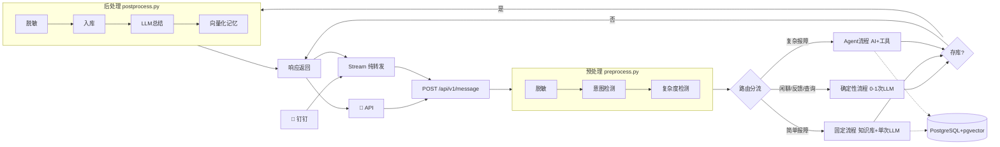

# 🛠️ Ops Agent -- 运维任务智能处理系统


一个基于 **FastAPI + LangChain + PostgreSQL + pgvector** 的智能运维任务处理系统。


> **核心能力：** 统一 API 入口，消息预处理（脱敏+意图+复杂度），混合路由（确定性流程+Agent），模型路由，交互记忆持久化，钉钉 Stream 接入。


---


## 架构概览





### 混合架构说明


核心原则：**能确定的用规则，不确定的才交给 AI。**


| 路由分支 | 处理方式 | LLM 调用 | 存库 | 适用场景 |

|---------|---------|---------|------|---------|

| **闲聊** | 确定性流程：快速 LLM 回复 | 1次（max_tokens=200） | 否 | 问候/致谢/测试 |

| **反馈** | 确定性流程：复用 feedback.py | 0次 | 否 | 已解决/未解决 |

| **查询状态** | 确定性流程：查数据库 | 0次 | 否 | 我的任务/进度 |

| **简单报障** | 固定流程：知识库+单次 LLM | 1次 | 是 | 打印机/VPN/邮箱 |

| **复杂报障** | Agent 流程：AI+工具调用 | 2-4次 | 是 | 服务器/数据库/网络 |

| **转人工** | Agent 流程：分配工程师 | 2-4次 | 是 | 明确要求人工 |


| 层 | 模块 | 职责 |

|----|------|------|

| **预处理层** | `preprocess.py` | 脱敏（5类正则）+ 意图检测（6种意图）+ 复杂度检测（3档），规则优先 + 轻量 LLM 兜底 |

| **混合路由** | `router.py` | 按意图/复杂度分流：确定性流程（闲聊/反馈/查询/简单报障）+ Agent 流程（复杂报障）|

| **Agent 层** | `ai_agent.py` + `agent_tools.py` | 按复杂度路由模型，意图注入上下文，单 Agent 自主调用工具（仅复杂问题） |

| **后处理层** | `postprocess.py` + `memory.py` | 二次脱敏 + 入库 + LLM 总结 + 向量化持久化记忆（仅报障场景） |


---


## 项目结构


```

ops-agent/

├── README.md                 ← 本文档

├── requirements.txt          ← Python 依赖

├── .env.example              ← 环境变量模板

├── CHANGELOG.md              ← 更新日志

├── 新版架构方案.md            ← v2.0 架构设计文档

├── 运维Agent框架文档.md       ← 框架设计文档（含版本控制）

├── 第一阶段需求文档.md        ← 第一阶段需求设计文档

│

└── data/                     ← 数据与代码

    ├── .env                  ← 实际环境变量（不提交！）

    ├── engineers.json        ← 工程师名单（首次启动自动迁移到 DB）

    ├── knowledge/            ← 知识库文档（skill 文档）

    │

    └── src/                  ← 源代码

        ├── __init__.py

        │

        ├── config.py         ← ★ 模型路由配置

        ├── models.py         ← 数据结构定义（Intent/Complexity/MessageRequest）

        ├── database.py       ← ORM 模型（PostgreSQL+pgvector）

        ├── db_manager.py     ← 数据库 CRUD 封装

        ├── embedding.py      ← ★ 共享 Embedding 服务

        ├── tools.py          ← 知识库检索工具

        │

        ├── preprocess.py     ← ★ 预处理层（脱敏+意图+复杂度）

        ├── router.py         ← ★ 混合路由（确定性流程+Agent分流）

        ├── ai_agent.py       ← ★ AI 处理层（模型路由+工具调用，仅复杂问题）

        ├── agent_tools.py    ← ★ AI 工具定义（time/knowledge/memory/assign）

        ├── postprocess.py    ← ★ 后处理层（脱敏入库+总结+向量化）

        ├── memory.py         ← ★ 交互记忆管理（向量存储+检索）

        │

        ├── dingtalk_stream.py← 钉钉 Stream（纯转发层）

        ├── scheduler.py      ← 定时提醒调度器（超时提醒/转派）

        ├── graph.py          ← 旧版 LangGraph 工作流（兼容保留）

        ├── feedback.py       ← 反馈处理（被 router 复用）

        └── main.py           ← FastAPI 入口（统一 API + 旧版兼容）

```


> ★ 标记为 v2.0 新架构新增模块


---


## 快速开始


### 1. 环境要求


- Python 3.10+

- PostgreSQL 16+（含 pgvector 扩展，首次启动自动建库建表）

- 一个 LLM API Key（[DeepSeek](https://platform.deepseek.com) 推荐）

- Windows / macOS / Linux


### 2. 安装依赖


```bash

git clone <your-repo-url>

cd ops-agent

# 开发环境（锁定主依赖版本）
pip install -r requirements.txt

# 生产部署（精确复现，含全部传递依赖）
pip install -r requirements.lock

```


### 3. 配置环境变量


```bash

cp .env.example data/.env

# 编辑 data/.env

```


```env

# ========== LLM API（必填）==========

open_code_go_api=sk-你的API密钥

model=deepseek-chat

base_url=https://api.deepseek.com


# ========== PostgreSQL（必填，首次启动自动建库建表+pgvector）==========

PG_HOST=localhost

PG_PORT=5432

PG_USER=postgres

PG_PASSWORD=你的密码

PG_DATABASE=ops_agent


# ========== 模型路由（可选，有默认值）==========

MODEL_SIMPLE=deepseek-chat

MODEL_MEDIUM=deepseek-chat

MODEL_HARD=deepseek-reasoner


# ========== 预处理（可选）==========

INTENT_LLM_FALLBACK=true


# ========== LLM 超时（可选，单位秒）==========
# 单次 LLM 调用超时，超时由调用方捕获降级处理
LLM_REQUEST_TIMEOUT=60
# hard 问题（deepseek-reasoner）推理慢，单独放宽
LLM_REQUEST_TIMEOUT_HARD=120


# ========== LLM 重试/熔断（可选）==========
LLM_RETRY_MAX_ATTEMPTS=3        # 最大重试次数（含首次）
LLM_RETRY_MIN_WAIT=1            # 退避最小等待（秒）
LLM_RETRY_MAX_WAIT=8            # 退避最大等待（秒）
LLM_CIRCUIT_FAILURE_THRESHOLD=5 # 连续失败多少次触发熔断
LLM_CIRCUIT_RECOVERY_SECONDS=60 # 熔断恢复时间（秒）


# ========== 记忆系统（可选）==========

MEMORY_ENABLED=true

MEMORY_SEARCH_TOP_K=3


# ========== 钉钉 Stream（可选）==========

DINGTALK_CLIENT_ID=你的AppKey

DINGTALK_CLIENT_SECRET=你的AppSecret


# ========== 定时提醒（可选）==========

REMINDER_INTERVAL_MINUTES=30

REMINDER_MAX_COUNT=3


# ========== API 鉴权（生产必填，留空则该角色不启用）==========
# service  : 机器人/内部服务调用 POST /api/v1/message
# readonly : 只读查询 GET /tasks、/engineers、/memories
# admin    : 全部接口
# 建议用随机长字符串，三把 Key 互不相同
API_KEY_SERVICE=your-service-key-here
API_KEY_READONLY=your-readonly-key-here
API_KEY_ADMIN=your-admin-key-here

# 钉钉 Stream 转发地址（默认本地，可选）
API_MESSAGE_URL=http://localhost:8000/api/v1/message


# ========== 日志（可选）==========
LOG_LEVEL=INFO              # DEBUG/INFO/WARNING/ERROR
LOG_FILE=data/logs/ops_agent.log  # 日志文件路径，留空则仅控制台
LOG_MAX_SIZE=10             # 单文件最大 MB，超过自动轮转
LOG_BACKUP_COUNT=5          # 保留几个历史日志文件

```


### 4. 准备知识库


在 `data/knowledge/` 下创建 `.md` 文件：


```markdown

# 问题标题


## 症状

- 症状描述


## 解决步骤

1. 第一步

2. 第二步

```


### 5. 配置工程师名单


编辑 `data/engineers.json`（首次启动自动迁移到数据库）：


```json

[

  {

    "name": "张三",

    "staff_id": "",

    "skills": ["打印机", "电脑硬件", "Windows系统"],

    "mobile": "13800000001",

    "dingtalk_user_id": "",

    "available": true

  }

]

```


> `staff_id`（工号）可留空，工程师首次发消息时自动从钉钉回调回填；填写后直接走工号绑定。

> `name` 允许同名，靠 `staff_id` 唯一识别；姓名里混入手机号会在导入时自动剥离。


### 6. 启动


```bash

cd data

python -m src.main

```


启动时自动：建库 -> 建表 -> 迁移工程师数据 -> 启动定时提醒 -> 启动 FastAPI + 钉钉 Stream


### 7. 测试


```bash

# ★ 统一入口（推荐）

curl -X POST http://localhost:8000/api/v1/message \

  -H "Content-Type: application/json" \

  -d '{"source":"api","sender_name":"小明","content":"打印机连不上"}'


# 健康检查

curl http://localhost:8000/health


# 查询任务列表

curl http://localhost:8000/tasks


# 查询工程师名单

curl http://localhost:8000/engineers


# 查询交互记忆

curl http://localhost:8000/memories

```


---


## 预处理层


消息进入 API 后，**AI 调用前**先完成三步预处理：


### 脱敏


| 类型 | 正则匹配 | 替换为 | 示例 |

|------|---------|--------|------|

| 手机号 | `1[3-9]\d{9}` | `[PHONE]` | `13800001234` -> `[PHONE]` |

| IP 地址 | `\d{1,3}\.\d{1,3}\.\d{1,3}\.\d{1,3}` | `[IP]` | `192.168.1.100` -> `[IP]` |

| 邮箱 | `[\w.-]+@[\w.-]+\.\w+` | `[EMAIL]` | `zhang@co.com` -> `[EMAIL]` |

| 身份证 | `\d{17}[\dXx]` | `[IDCARD]` | `110101199001011234` -> `[IDCARD]` |

| 密码 | `密码[是为：:]\s*(\S+)` | `[MASKED]` | `密码是abc123` -> `密码：[MASKED]` |


> 脱敏后文本发给 AI，原始文本不入库，入库时存脱敏版本。


### 意图检测


| 意图 | 说明 | 检测方式 |

|------|------|---------|

| `report_issue` | 报障 | 默认意图 |

| `casual_chat` | 闲聊 | 关键词：你好/谢谢/再见 |

| `feedback_resolved` | 反馈已解决 | 关键词：解决了/搞定了 |

| `feedback_unresolved` | 反馈未解决 | 关键词：没解决/还是不行 |

| `request_human` | 转人工 | 关键词：IT协助/需要工程师 |

| `query_status` | 查询任务状态 | 关键词：我的任务/进度 |


### 复杂度检测


| 复杂度 | 说明 | 驱动模型 |

|--------|------|---------|

| `simple` | 标准桌面问题 | deepseek-chat（快速便宜） |

| `medium` | 需要工具辅助排查 | deepseek-chat + 工具 |

| `hard` | 严重故障需人工 | deepseek-reasoner（推理模型） |


---


## 混合路由


预处理后按意图/复杂度分流，**确定性流程与 Agent 流程结合**：


| 路由分支 | 处理方式 | LLM 调用 | 特点 |

|---------|---------|---------|------|

| 闲聊 | 快速 LLM 回复 | 1次 | 不走 Agent，max_tokens=200 |

| 反馈 | 复用 feedback.py | 0次 | 升级/催办/关闭，纯 DB 操作 |

| 查询状态 | 查数据库返回 | 0次 | 纯 DB 操作 |

| 简单报障 | 知识库+单次 LLM | 1次 | 固定流程，一步到位，1-2秒 |

| 复杂报障 | Agent+工具调用 | 2-4次 | AI 自主决策，最多3轮工具调用 |

| 转人工 | Agent+工具调用 | 2-4次 | AI 调用 assign_engineer 工具 |


> 反馈无 active 任务时自动转为报障处理，重新检测复杂度。


---


## Agent 层（仅复杂问题）


### 模型路由


按复杂度自动选择模型，**简单问题用小模型省钱，复杂问题用大模型保证质量**：


```python

MODEL_ROUTING = {

    "simple": {"model": "deepseek-chat", "tools_enabled": False},

    "medium": {"model": "deepseek-chat", "tools_enabled": True},

    "hard":   {"model": "deepseek-reasoner", "tools_enabled": True},

}

```


### 工具调用（单 Agent，不做多节点编排）


| 工具 | 说明 |

|------|------|

| `get_current_time` | 获取当前时间 |

| `search_knowledge` | 检索知识库（skill 文档） |

| `search_memory` | 检索历史交互记忆 |

| `assign_engineer(candidates, title, desc)` | 分配工程师（AI 传候选人，纯算法选人） |

| `query_user_tasks` | 查询用户任务状态 |


> AI 自主决定是否调用工具，最多 3 轮工具调用，防止死循环。

> MCP（Model Context Protocol）作为预留扩展点，未来接入监控/工单/AD 域等外部系统。


---


## 后处理层


**仅对报障场景执行**（闲聊/反馈/查询跳过）：


```

AI 原始回答

  ↓

① 二次脱敏（AI 可能引用了敏感信息）

  ↓

② 入库（存脱敏版本 + intent/complexity/model_used）

  ↓

③ LLM 总结（"打印机离线 -> 重启服务"，不超过50字）

  ↓

④ 向量化存储（embedding 存入记忆库，供未来检索）

```


### 持久化记忆


每次报障交互都会生成一条记忆，向量化后存入 PostgreSQL memories 表（pgvector）：


```

用户第二次报"VPN连不上"

  ↓

search_memory 检索到："VPN连不上 -> 重装客户端 -> 已解决 (T1002)"

  ↓

AI 回答："您上次也遇到过 VPN 问题，当时通过重装客户端解决了..."

```


---


## 钉钉接入


钉钉 Stream 模式作为**纯转发层**，不处理业务逻辑：


```

钉钉消息 -> Stream 收到 -> 转发 POST /api/v1/message -> 收到响应 -> 回复用户

```


### 接入步骤


1. 在 [钉钉开放平台](https://open.dingtalk.com) 创建企业应用，获取 AppKey 和 AppSecret

2. 在 `.env` 中填入 `DINGTALK_CLIENT_ID` 和 `DINGTALK_CLIENT_SECRET`

3. 启动服务 -> 工程师给机器人发消息 -> UserID 自动绑定到数据库


---


## 定时提醒


任务分配后超时未解决，自动提醒并转派：


```

任务 assigned -> 30分钟未解决 -> 第1次提醒

             -> 30分钟 -> 第2次提醒

             -> 30分钟 -> 第3次提醒

             -> 30分钟（达上限3次）

               ├─ 有其他工程师 -> 自动转派（排除当前）

               └─ 仅一人 -> 继续提醒 + 通知 IT 群

```


---


## API 接口


> **鉴权说明**：除 `GET /health` 外，所有接口需在请求头携带 `X-API-Key`。
> - 写接口（`POST /api/v1/message`、`POST /task`）需 service 或 admin 角色 Key
> - 读接口（`GET /tasks`、`/engineers`、`/memories`）需 readonly 或 admin 角色 Key
> - 钉钉 Stream 内部转发会自动携带 service Key，无需手动配置


### POST /api/v1/message ★ 统一入口（推荐）


**请求：**

```json

{

  "source": "dingtalk",

  "sender_id": "REMOVED",

  "sender_name": "小明",

  "content": "打印机连不上，IP是192.168.1.100"

}

```


**响应：**

```json

{

  "intent": "report_issue",

  "complexity": "simple",

  "model_used": "deepseek-chat",

  "response": "请按以下步骤操作：1. 检查电源...\n\n📋 任务编号：T1001",

  "task_no": "T1001",

  "memory_saved": true

}

```


### POST /task（旧版兼容）


旧版 LangGraph 工作流接口，保留兼容。


### 管理接口


| 接口 | 方法 | 说明 |

|------|------|------|

| `/health` | GET | 健康检查 |

| `/tasks` | GET | 查询任务列表 |

| `/engineers` | GET | 查询工程师名单（含动态负载） |

| `/memories` | GET | 查询交互记忆 |


---


## 让 AI 理解本项目


```

这是一个基于 FastAPI + LangChain + PostgreSQL 的运维任务处理系统（v2.2 混合架构）。


统一入口：POST /api/v1/message 接管所有消息源（钉钉/API/Web）。

钉钉 Stream（dingtalk_stream.py）是纯转发层，收到消息转发给 API，零业务代码。


混合路由（router.py）：预处理后按意图/复杂度分流

- 确定性流程（不走Agent）：闲聊(快速LLM) / 反馈(复用feedback.py) / 查询(查DB) / 简单报障(知识库+单次LLM)

- Agent流程（仅复杂问题）：medium/hard报障 -> ai_agent.py 模型路由+工具调用，最多3轮


预处理层（preprocess.py）：脱敏（5类正则）-> 意图检测（6种）-> 复杂度检测（3档）

Agent层（ai_agent.py）：按复杂度路由模型，意图注入，单agent+5工具（agent_tools.py）

后处理层（postprocess.py）：仅报障场景 -> 二次脱敏 -> 入库 -> LLM总结 -> 向量化记忆（memory.py）


数据库：PostgreSQL + pgvector + SQLAlchemy 2.0，5张表：engineers/tasks/feedbacks/memories/knowledge_docs

知识库+记忆库：pgvector 向量检索（tools.py + memory.py），共享 embedding.py

负载均衡：graph.py assign_engineer()，作为AI工具被调用

定时提醒：scheduler.py，APScheduler后台扫描，3次未响应自动转派

旧版兼容：POST /task + graph.py + feedback.py 保留


入口 main.py，启动时自动建库建表+迁移engineers.json+启动定时提醒。

```


---


## 常见问题


| 问题 | 原因 | 解决 |

|------|------|------|

| 启动报 ModuleNotFoundError | 依赖未装 | `pip install -r requirements.txt` |

| 数据库连接失败 | PostgreSQL 未启动或密码错误 | 检查 PostgreSQL 服务 + `.env` 中 PG_* 配置 |

| 数据库表未创建 | 首次启动初始化失败 | 查看启动日志，确认 `init_db()` 和 pgvector 扩展安装成功 |

| 脱敏未生效 | 正则未覆盖 | 检查 `preprocess.py` 中 DESENSITIZE_PATTERNS |

| 意图检测误判 | 关键词未覆盖 | 检查 `preprocess.py` 关键词列表，或开启 LLM 兜底 |

| 模型路由不对 | `.env` 配置有误 | 检查 `MODEL_SIMPLE` / `MODEL_MEDIUM` / `MODEL_HARD` |

| 简单问题走了Agent | 复杂度检测不准 | 检查 `preprocess.py` 复杂度规则，或调整 HARD_KEYWORDS |

| 记忆未存储 | 记忆功能未启用 | 检查 `MEMORY_ENABLED=true` |

| 钉钉转发超时 | LLM 响应慢 | 调整 `dingtalk_stream.py` 中 timeout（默认 120s） |

| 定时提醒未触发 | 调度器未启动 | 查看启动日志是否有 `[scheduler] ✅ 定时提醒已启动` |

| 知识库检索不到 | 知识库未同步 | 重启服务触发同步，或检查 `knowledge_docs` 表 |

| 钉钉私聊通知发不出 | dingtalk_user_id 不正确 | 让工程师给机器人发消息自动绑定 |


---


## 技术栈


| 组件 | 选型 | 原因 |

|------|------|------|

| AI 框架 | LangChain tool calling | 单 agent + 工具调用，灵活简洁 |

| 模型路由 | .env 配置 + config.py | 按复杂度选模型，成本可控 |

| 向量检索 | PostgreSQL + pgvector | 原生向量检索，知识库+记忆统一存储 |

| 关系型数据库 | PostgreSQL | 任务/工程师/反馈/记忆/知识库持久化 |

| ORM | SQLAlchemy 2.0 | Mapped 风格类型安全 |

| Embedding | HuggingFace (text2vec-base-chinese) | 免费、离线、中文优化 |

| LLM | OpenAI 兼容 API | DeepSeek/OpenAI/通义千问随意切换 |

| Web 框架 | FastAPI | 异步、自带 Swagger 文档 |

| 定时调度 | APScheduler | 进程内后台调度 |

| 脱敏 | Python regex | 确定性规则，零 LLM 成本 |


---


## 版本


| 版本 | 日期 | 说明 |

|------|------|------|

| **v3.3.0** | 2026-07-16 | 向量检索 HNSW 索引（知识库+记忆库，O(n)->O(log n)） |

| v3.2.0 | 2026-07-16 | 依赖版本锁定（requirements.txt 锁定确切版本 + requirements.lock 完整快照） |

| v3.1.0 | 2026-07-16 | DB N+1 查询消除（批量统计+复合索引）+ 反馈身份识别改用 staff_id 优先 |

| v3.0.0 | 2026-07-16 | LLM 调用次数削减（意图+复杂度合并为单次）+ 摘要异步化（不阻塞用户响应） |

| v2.9.0 | 2026-07-16 | LLM 重试+熔断保护（safe_llm_invoke 统一入口，指数退避重试+熔断器） |

| v2.8.0 | 2026-07-16 | 结构化日志系统（log_config + request_id 关联 + 全项目 15 模块 print 替换为 logging） |

| v2.7.0 | 2026-07-15 | 难度枚举统一（difficulty 从 easy/hard 改为 simple/medium/hard，与 complexity 一致） |

| v2.6.0 | 2026-07-15 | 任务状态判定改为结构化标记透传（不再字符串匹配 LLM 回答） |

| v2.5.0 | 2026-07-15 | API 鉴权（API Key + 角色控制）+ async 阻塞修复（线程池）+ LLM 调用超时机制 |

| v2.4.0 | 2026-07-10 | 工程师身份按工号绑定（staff_id 唯一识别 + 同名消歧 + 姓名手机号自动剥离） |

| v2.3.0 | 2026-07-10 | 负载均衡改为 Skill+Tool 模式（去掉工具内 LLM） |

| v2.2.0 | 2026-07-10 | 数据库统一：PostgreSQL + pgvector（废弃 ChromaDB） |

| v2.1.0 | 2026-07-10 | 混合路由：确定性流程+Agent，简单问题一步到位 |

| v2.0.0 | 2026-07-10 | 新版架构：统一入口 + 预处理 + 模型路由 + 工具化AI + 记忆 |

| v1.1.0 | 2026-07-10 | 定时重新提醒：超时提醒 + 自动转派 |

| v1.0.0 | 2026-07-09 | 第一次大改版：任务持久化 + 反馈闭环 + 负载均衡 |

| v0.2.0 | 2026-06-15 | 钉钉 Stream 接入 |

| v0.1.0 | 2026-06 | 初始版本 |


详见 `新版架构方案.md`、`运维Agent框架文档.md` 第十一章「版本控制」和 `CHANGELOG.md`。


---


## License


MIT

