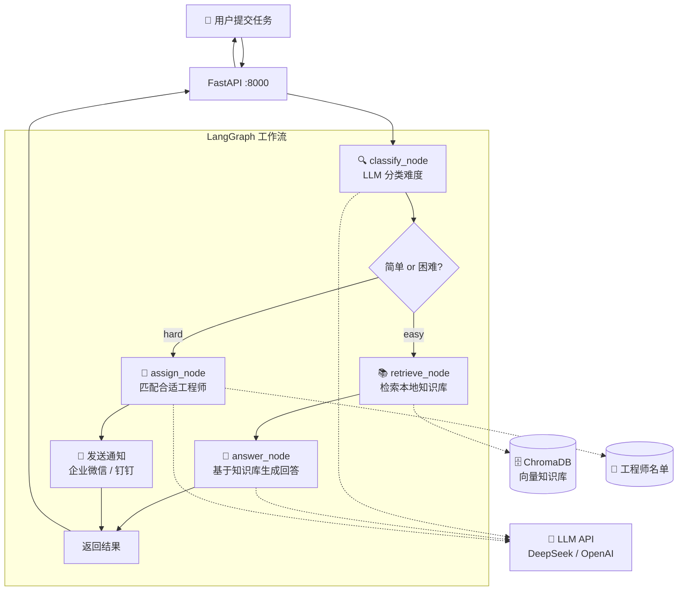

# 🛠️ Ops Agent —— 运维任务智能分配系统

一个基于 **LangGraph + FastAPI + ChromaDB** 的智能运维任务分配 Agent。

> **核心能力：** 初级桌面问题自动回答，困难任务自动匹配合适的 IT 工程师并发送通知。

---

## 架构概览



---

## 项目结构

```
ops-agent/
├── README.md                 ← 本文档
├── requirements.txt          ← Python 依赖
├── .gitignore
├── .env.example              ← 环境变量模板（可提交）
│
└── data/                     ← 数据与代码
    ├── .env                  ← 实际环境变量（不提交！）
    ├── engineers.json        ← 工程师名单
    │
    ├── knowledge/            ← 知识库文档
    │   ├── printer.md        ← 打印机故障
    │   ├── vpn.md            ← VPN 问题
    │   └── email.md          ← 邮箱配置
    │
    ├── chroma_db/            ← 向量数据库（自动生成）
    │
    └── src/                  ← 源代码
        ├── __init__.py
        ├── models.py         ← 数据结构定义
        ├── tools.py          ← 工具函数（知识库检索、工程师加载）
        ├── graph.py          ← LangGraph 工作流（核心调度）
        └── main.py           ← FastAPI 入口
```

---

## 快速开始

### 1. 环境要求

- Python 3.10+
- 一个 LLM API Key（[DeepSeek](https://platform.deepseek.com) 推荐，便宜好用）
- Windows / macOS / Linux

### 2. 安装依赖

```bash
git clone <your-repo-url>
cd ops-agent
pip install -r requirements.txt
```

### 3. 配置环境变量

复制模板并编辑：

```bash
cp .env.example data/.env
# 编辑 data/.env，填入你的 LLM API 信息
```

`.env` 内容：

```env
# LLM API 配置（必填）
open_code_go_api=sk-你的API密钥
model=deepseek-chat
base_url=https://api.deepseek.com

# 企业微信通知（可选，不配也能跑）
WECHAT_WEBHOOK=https://qyapi.weixin.qq.com/cgi-bin/webhook/send?key=xxx

# 钉钉通知（可选）
DINGTALK_WEBHOOK=https://oapi.dingtalk.com/robot/send?access_token=xxx
```

> **支持的 LLM 厂商：** DeepSeek / OpenAI / 通义千问 / 任何兼容 OpenAI API 格式的服务。

### 4. 准备知识库

在 `data/knowledge/` 下创建 `.md` 文件，格式：

```markdown
# 问题标题

## 症状
- 症状描述

## 解决步骤
1. 第一步
2. 第二步
```

### 5. 配置工程师名单

编辑 `data/engineers.json`：

```json
[
  {
    "name": "张三",
    "skills": ["打印机", "电脑硬件", "Windows系统"],
    "current_load": 2,
    "available": true
  },
  {
    "name": "李四",
    "skills": ["网络", "VPN", "防火墙"],
    "current_load": 1,
    "available": true
  }
]
```

### 6. 启动

```bash
cd data
python -m src.main
```

看到 `Uvicorn running on http://0.0.0.0:8000` 即启动成功。

### 7. 测试

```bash
# 健康检查
curl http://localhost:8000/health

# 简单任务（应自动回答）
curl -X POST http://localhost:8000/task \
  -H "Content-Type: application/json" \
  -d '{"title":"打印机连不上","description":"惠普打印机离线","submitted_by":"小明"}'

# 困难任务（应分配给工程师）
curl -X POST http://localhost:8000/task \
  -H "Content-Type: application/json" \
  -d '{"title":"数据库宕机","description":"MySQL主库崩溃","submitted_by":"运维"}'
```

---

## API 接口

### POST /task

**请求：**
```json
{
  "title": "打印机无法连接",
  "description": "惠普打印机突然显示离线状态",
  "submitted_by": "小明"
}
```

**响应（简单任务）：**
```json
{
  "status": "auto_answered",
  "difficulty": "easy",
  "response": "请按以下步骤操作：\n1. 检查电源...",
  "assigned_to": null
}
```

**响应（困难任务）：**
```json
{
  "status": "assigned",
  "difficulty": "hard",
  "response": "已分配给 **王五**。\n分配原因：需要数据库技能...",
  "assigned_to": "王五"
}
```

---

## 扩展指南

### 对接钉钉机器人

1. 在钉钉群 → 群设置 → 智能群助手 → 添加机器人 → 自定义
2. 复制 Webhook 地址，填入 `.env` 的 `DINGTALK_WEBHOOK`
3. 修改 `graph.py` 的 `_notify_engineer` 函数，加入钉钉消息格式：

```python
# 钉钉消息格式
dingtalk_payload = {
    "msgtype": "markdown",
    "markdown": {
        "title": "新任务分配",
        "text": f"""## 🚨 新任务分配
> 负责人：{engineer_name}
> 任务：{task.title}

**详细描述：**
{task.description}"""
    }
}
```

### 对接企业微信

已内置支持，只需在 `.env` 中配置 `WECHAT_WEBHOOK`。

### 增加新知识

往 `data/knowledge/` 添加 `.md` 文件 → 删除 `data/chroma_db/` → 重启服务。向量库会自动重建。

### 增加工程师

编辑 `data/engineers.json`，无需重启，下次请求自动生效。

### 增加「中等难度」分类

1. `models.py` 的 `Difficulty` 枚举加 `MEDIUM = "medium"`
2. `graph.py` 的 `CLASSIFY_PROMPT` 加 medium 定义
3. `route_after_classify` 加 medium 分支（例如：中等任务先检索知识库，LLM 确认后再决定自动回复还是转人工）

---

## 让 AI 理解本项目

如果你想用 AI 编程工具（Cursor / Windsurf / Copilot）继续开发，把这些上下文告诉 AI：

> 这是一个基于 LangGraph 的运维任务分配 Agent。工作流：classify_node 分类难度 → easy 走 retrieve_node + answer_node 自动回复，hard 走 assign_node 匹配工程师发通知。知识库用 ChromaDB + HuggingFace 本地 embedding，LLM 用 OpenAI 兼容 API。入口是 main.py 的 FastAPI。

把 `README.md` 和 `运维Agent框架文档.md` 一起作为 AI 的上下文引用，AI 就能准确理解项目。

---

## 常见问题

| 问题 | 原因 | 解决 |
|------|------|------|
| 启动报 ModuleNotFoundError | 依赖未装 | `pip install -r requirements.txt` |
| 中文显示乱码 | PowerShell 编码问题 | 用 `curl.exe` 或 Python `requests` 测试 |
| embedding 模型下载失败 | HuggingFace 被墙 | 已配置 `hf-mirror.com` 镜像 |
| 知识库检索不到 | 向量库未重建 | 删 `chroma_db/` 后重启 |
| LLM 返回 404 | base_url 配错 | 检查 `.env` 的 `base_url` 是否为 LLM API 地址 |
| 通知发不出去 | Webhook 未配 | 检查 `.env` 的 `WECHAT_WEBHOOK` / `DINGTALK_WEBHOOK` |

---

## 技术栈

| 组件 | 选型 | 原因 |
|------|------|------|
| Agent 框架 | LangGraph | 显式状态图，比黑盒 Agent 更可控 |
| 向量数据库 | ChromaDB | 轻量、零配置、本地运行 |
| Embedding | HuggingFace (text2vec-base-chinese) | 免费、离线、中文优化 |
| LLM | OpenAI 兼容 API | 换模型只需改 URL 和 Key |
| Web 框架 | FastAPI | 异步、自带文档、部署简单 |

---

## License

MIT
