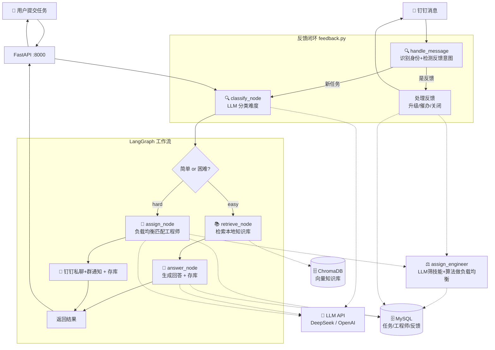

# 🛠️ Ops Agent -- 运维任务智能分配系统

一个基于 **LangGraph + FastAPI + ChromaDB + MySQL** 的智能运维任务分配 Agent。

> **核心能力：** 钉钉 Stream 单聊接入，简单问题自动回答，困难任务负载均衡匹配工程师并私聊通知，支持用户/工程师双向反馈闭环，任务全生命周期持久化追踪。

---

## 架构概览



### 任务状态机

```
┌────────────────┐     用户反馈"未解决"      ┌──────────────┐     工程师回复"已解决"     ┌──────────┐
│ auto_answered  │ ─────────────────────────-> │   assigned   │ ───────────────────────-> │ resolved │
│  (自动已回答)   │                             │  (已分配)     │                           │  (已解决)  │
└────────────────┘                             └──────────────┘                           └──────────┘
        │                                           │
        │ 用户反馈"已解决"                            │ 用户反馈"未解决"-> 重新催办
        └───────────────────────────────────────────┘
```

---

## 项目结构

```
ops-agent/
├── README.md                 ← 本文档
├── requirements.txt          ← Python 依赖
├── .gitignore
├── .env.example              ← 环境变量模板（可提交）
├── CHANGELOG.md              ← 更新日志
├── 运维Agent框架文档.md       ← 框架设计文档（含版本控制）
├── 第一阶段需求文档.md        ← 第一阶段需求设计文档
│
└── data/                     ← 数据与代码
    ├── .env                  ← 实际环境变量（不提交！）
    ├── engineers.json        ← 工程师名单（首次启动自动迁移到 DB）
    │
    ├── knowledge/            ← 知识库文档
    │   ├── printer.md        ← 打印机故障
    │   ├── vpn.md            ← VPN 问题
    │   └── ...
    │
    ├── chroma_db/            ← 向量数据库（自动生成）
    │
    └── src/                  ← 源代码
        ├── __init__.py
        ├── models.py         ← 数据结构定义（Pydantic）
        ├── database.py       ← SQLAlchemy 连接 + ORM 模型定义
        ├── db_manager.py     ← 数据库 CRUD 操作封装
        ├── tools.py          ← 工具函数（知识库检索、工程师加载）
        ├── graph.py          ← LangGraph 工作流（核心调度 + 负载均衡）
        ├── feedback.py       ← 反馈识别与处理（反馈闭环）
        ├── dingtalk_stream.py← 钉钉 Stream 单聊机器人 + 消息路由
        └── main.py           ← FastAPI 入口 + 钉钉启动 + 启动初始化
```

---

## 快速开始

### 1. 环境要求

- Python 3.10+
- MySQL 8.0+（首次启动自动建库建表）
- 一个 LLM API Key（[DeepSeek](https://platform.deepseek.com) 推荐，便宜好用）
- Windows / macOS / Linux

### 2. 安装依赖

```bash
git clone <your-repo-url>
cd ops-agent
pip install -r requirements.txt
```

### 3. 配置环境变量

复制模板并编辑：

```bash
cp .env.example data/.env
# 编辑 data/.env，填入你的 LLM API 和 MySQL 信息
```

`.env` 内容：

```env
# LLM API 配置（必填）
open_code_go_api=sk-你的API密钥
model=deepseek-chat
base_url=https://api.deepseek.com

# MySQL 数据库配置（必填，首次启动自动建库建表）
MYSQL_HOST=localhost
MYSQL_PORT=3306
MYSQL_USER=root
MYSQL_PASSWORD=你的密码
MYSQL_DATABASE=ops_agent

# 企业微信通知（可选，不配也能跑）
WECHAT_WEBHOOK=https://qyapi.weixin.qq.com/cgi-bin/webhook/send?key=xxx

# 钉钉 Stream 模式（必配，用于接收单聊消息和自动回复）
DINGTALK_CLIENT_ID=你的AppKey
DINGTALK_CLIENT_SECRET=你的AppSecret
```

> **支持的 LLM 厂商：** DeepSeek / OpenAI / 通义千问 / 任何兼容 OpenAI API 格式的服务。

### 4. 准备知识库

在 `data/knowledge/` 下创建 `.md` 文件，格式：

```markdown
# 问题标题

## 症状
- 症状描述

## 解决步骤
1. 第一步
2. 第二步
```

### 5. 配置工程师名单

编辑 `data/engineers.json`（首次启动后自动迁移到数据库）：

```json
[
  {
    "name": "张三",
    "skills": ["打印机", "电脑硬件", "Windows系统"],
    "mobile": "13800000001",
    "dingtalk_user_id": "",
    "available": true
  },
  {
    "name": "李四",
    "skills": ["网络", "VPN", "防火墙"],
    "mobile": "13800000002",
    "dingtalk_user_id": "",
    "available": true
  }
]
```

> 💡 `dingtalk_user_id` 可以留空，工程师首次给机器人发消息后会自动回填到数据库。
> 💡 `current_load` 无需配置，系统会动态查询活跃任务数自动计算。

### 6. 启动

```bash
cd data
python -m src.main
```

启动时会自动：建库 -> 建表 -> 迁移工程师数据 -> 启动 FastAPI + 钉钉 Stream

看到 `Uvicorn running on http://0.0.0.0:8000` 即启动成功。

### 7. 测试

```bash
# 健康检查
curl http://localhost:8000/health

# 查询任务列表
curl http://localhost:8000/tasks

# 查询工程师名单（含动态负载）
curl http://localhost:8000/engineers

# 简单任务（应自动回答）
curl -X POST http://localhost:8000/task \
  -H "Content-Type: application/json" \
  -d '{"title":"打印机连不上","description":"惠普打印机离线","submitted_by":"小明"}'

# 困难任务（应分配给工程师）
curl -X POST http://localhost:8000/task \
  -H "Content-Type: application/json" \
  -d '{"title":"数据库宕机","description":"MySQL主库崩溃","submitted_by":"运维"}'
```

---

## 钉钉单聊机器人

项目已内置钉钉 Stream 模式支持，启动后自动连接钉钉 WebSocket 长连接。

### 接入步骤

1. 在 [钉钉开放平台](https://open.dingtalk.com) 创建企业应用，获取 AppKey 和 AppSecret
2. 在 `.env` 中填入 `DINGTALK_CLIENT_ID` 和 `DINGTALK_CLIENT_SECRET`
3. 在 `engineers.json` 中预填工程师信息（姓名、技能、手机），`dingtalk_user_id` 留空
4. 启动服务 -> 让每位工程师给机器人发一条消息 -> UserID 自动回填到数据库

### 工程师 ID 自动绑定

工程师首次给机器人发消息时，系统会自动将钉钉 UserID 写入数据库，
后续困难任务即可通过钉钉私聊通知对应工程师。

---

## 反馈闭环

系统支持用户和工程师的双向反馈，形成完整的工单生命周期：

| 反馈场景 | 处理方式 |
|---------|---------|
| 用户回复"搞定了/好了" | 自动关闭任务（auto_answered -> resolved） |
| 用户回复"还是不行/没解决" | auto_answered 升级分配工程师；assigned 重新催办 |
| 工程师回复"已解决/搞定" | 标记任务已解决 + 私聊通知提交人 |

反馈识别采用关键词匹配，不消耗 LLM 调用。消息路由优先判断反馈，再决定是否走新任务流程。

---

## 负载均衡

工程师分配采用混合策略：**LLM 筛技能 + 算法做负载均衡**

```
LLM 分析任务 -> 返回技能匹配的候选人列表
  ↓
算法从候选人中选 current_load 最低 & available=true 的
  ↓
优先分配没有任务的工程师，同负载随机选择
```

- **LLM 负责"谁会做"**：根据任务描述返回技能匹配的候选人
- **算法负责"谁来做"**：从候选人中选负载最低的在岗工程师
- 全部不在岗时仍从匹配人选最低负载（通知后等待）

---

## API 接口

### POST /task

**请求：**
```json
{
  "title": "打印机无法连接",
  "description": "惠普打印机突然显示离线状态",
  "submitted_by": "小明"
}
```

**响应（简单任务）：**
```json
{
  "status": "auto_answered",
  "difficulty": "easy",
  "response": "请按以下步骤操作：\n1. 检查电源...\n\n📋 任务编号：T1001（如未解决请回复"未解决"）",
  "assigned_to": null
}
```

**响应（困难任务）：**
```json
{
  "status": "assigned",
  "difficulty": "hard",
  "response": "已分配给 **王五**。\n分配原因：需要数据库技能...\n\n📋 任务编号：T1002",
  "assigned_to": "王五"
}
```

### GET /tasks

查询最近任务列表（默认 20 条），返回任务编号、状态、分配工程师等信息。

### GET /engineers

查询工程师名单，含动态计算的 `current_load`（当前活跃任务数）。

### GET /health

健康检查。

---

## 扩展指南

### 对接钉钉群通知

已内置群 Webhook 通知支持。在 `.env` 中配置 `DINGTALK_WEBHOOK` 后，
困难任务会自动在群里发送简报并 @ 对应工程师。

### 对接企业微信

已内置支持，只需在 `.env` 中配置 `WECHAT_WEBHOOK`。

### 增加新知识

往 `data/knowledge/` 添加 `.md` 文件即可，系统支持增量热更新，无需重启。

### 增加工程师

启动后工程师数据存储在 MySQL `engineers` 表中。可通过 API 或直接操作数据库增删改，下次请求自动生效。

### 增加「中等难度」分类

1. `models.py` 的 `Difficulty` 枚举加 `MEDIUM = "medium"`
2. `graph.py` 的 `CLASSIFY_PROMPT` 加 medium 定义
3. `route_after_classify` 加 medium 分支（例如：中等任务先检索知识库，LLM 确认后再决定自动回复还是转人工）

---

## 让 AI 理解本项目

如果你想用 AI 编程工具（Cursor / Windsurf / Copilot）继续开发，把这些上下文告诉 AI：

> 这是一个基于 LangGraph + MySQL 的运维任务分配 Agent。接入钉钉 Stream 模式（dingtalk_stream.py），通过 WebSocket 接收单聊消息。消息路由：feedback.py 先判断是否为反馈（关键词匹配），是反馈则直接处理（升级/催办/关闭），不是反馈才走 Agent 工作流。工作流：classify_node 分类难度 -> easy 走 retrieve_node + answer_node 自动回复并存库，hard 走 assign_node 调用 assign_engineer() 负载均衡匹配工程师并私聊通知。负载均衡策略：LLM 返回候选人列表 + 算法选最低负载。任务状态机：auto_answered -> assigned -> resolved。数据库用 MySQL + SQLAlchemy 2.0，db_manager.py 封装全部 CRUD。工程师首次发消息自动回填 dingtalk_user_id 到 DB。知识库用 ChromaDB + HuggingFace 本地 embedding，LLM 用 OpenAI 兼容 API。入口是 main.py 的 FastAPI + 钉钉 Stream，启动时自动建库建表 + 迁移 engineers.json。

把 `README.md` 和 `运维Agent框架文档.md` 一起作为 AI 的上下文引用，AI 就能准确理解项目。

---

## 常见问题

| 问题 | 原因 | 解决 |
|------|------|------|
| 启动报 ModuleNotFoundError | 依赖未装 | `pip install -r requirements.txt` |
| 数据库连接失败 | MySQL 未启动或密码错误 | 检查 MySQL 服务 + `.env` 中 MYSQL 配置 |
| 数据库表未创建 | 首次启动初始化失败 | 查看启动日志，确认 `init_db()` 执行成功 |
| 工程师名单为空 | DB 迁移未执行 | 确认 `engineers.json` 存在，重启触发迁移 |
| 中文显示乱码 | PowerShell 编码问题 | 用 `curl.exe` 或 Python `requests` 测试 |
| embedding 模型下载失败 | HuggingFace 被墙 | 已配置 `hf-mirror.com` 镜像 |
| 知识库检索不到 | 向量库未重建 | 删 `chroma_db/` 后重启 |
| LLM 返回 404 | base_url 配错 | 检查 `.env` 的 `base_url` 是否为 LLM API 地址 |
| 钉钉私聊通知发不出 | dingtalk_user_id 不正确 | 让工程师给机器人发消息，自动绑定 Staff ID |
| 反馈未识别 | 关键词不在列表中 | 检查 `feedback.py` 中关键词定义，按需补充 |

---

## 技术栈

| 组件 | 选型 | 原因 |
|------|------|------|
| Agent 框架 | LangGraph | 显式状态图，比黑盒 Agent 更可控 |
| 向量数据库 | ChromaDB | 轻量、零配置、本地运行 |
| 关系型数据库 | MySQL | 生产级、并发好、任务持久化 |
| ORM | SQLAlchemy 2.0 | Mapped 风格类型安全，社区成熟 |
| Embedding | HuggingFace (text2vec-base-chinese) | 免费、离线、中文优化 |
| LLM | OpenAI 兼容 API | 换模型只需改 URL 和 Key |
| Web 框架 | FastAPI | 异步、自带文档、部署简单 |

---

## 版本

| 版本 | 日期 | 说明 |
|------|------|------|
| **v1.0.0** | 2026-07-09 | 第一次大改版：任务持久化 + 反馈闭环 + 负载均衡 |
| v0.2.0 | 2026-06-15 | 钉钉 Stream 接入 |
| v0.1.0 | 2026-06 | 初始版本 |

详见 `运维Agent框架文档.md` 第十一章「版本控制」和 `CHANGELOG.md`。

---

## License

MIT
