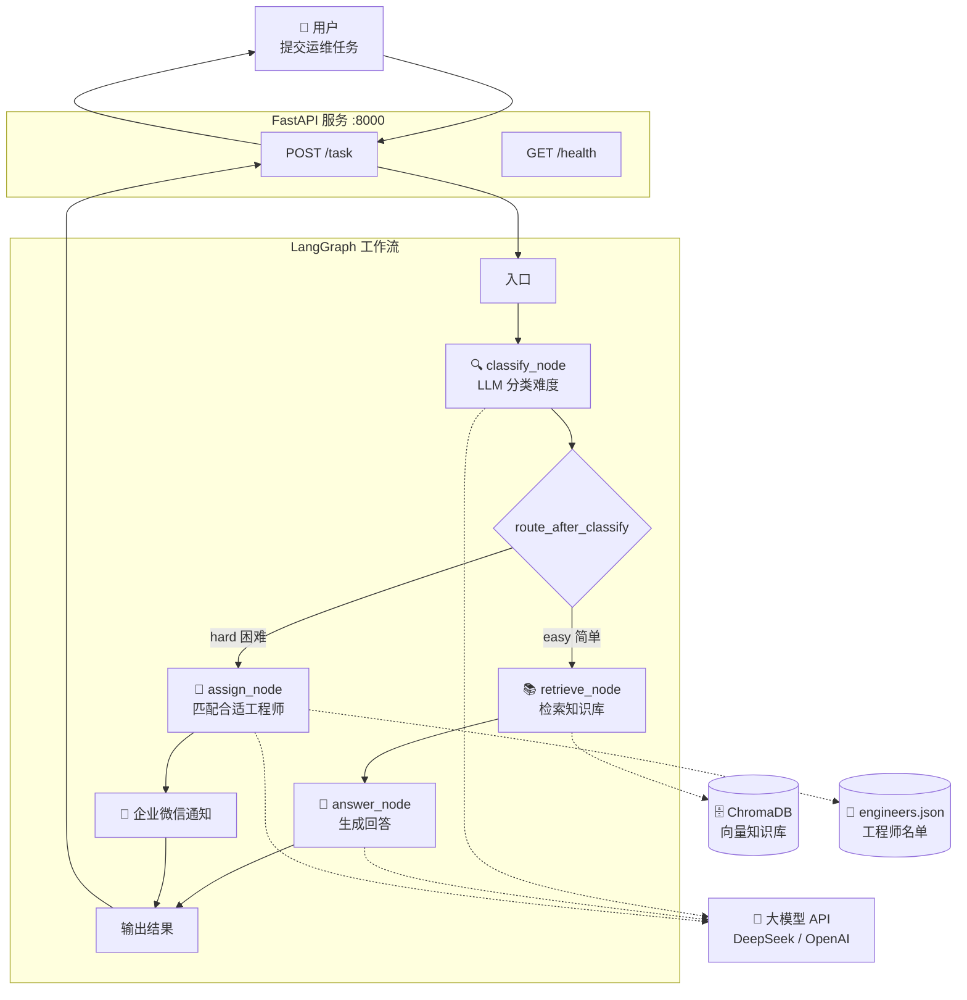

# 🛠️ 运维任务分配 Agent —— 框架文档

## 一、项目概述

一个基于 **LangGraph + FastAPI + ChromaDB** 的智能运维任务分配系统。

### 它能做什么

| 场景 | 自动化流程 |
|------|-----------|
| 用户提交「打印机连不上」 | → 自动分类为「简单」→ 查知识库 → 自动回复解决步骤 |
| 用户提交「数据库主库崩溃」 | → 自动分类为「困难」→ 匹配最合适的工程师 → 发送通知 |

### 核心技术栈

| 技术 | 在项目中扮演的角色 |
|------|-------------------|
| **LangGraph** | 工作流编排引擎——按「分类→检索/分配→回答」的顺序执行 |
| **ChromaDB** | 向量知识库——把运维文档存成向量，支持语义检索 |
| **FastAPI** | Web 接口——把 Agent 暴露为 HTTP API，供外部调用 |
| **LangChain** | LLM 调用封装——统一调用大模型、管理 Prompt |

---

## 二、系统架构



---

## 三、项目文件结构

```
D:\运维任务分配agent\
├── requirements.txt          ← Python 依赖清单
├── 运维Agent框架文档.md       ← 本文档
│
└── data/                     ← 项目代码和数据
    ├── .env                  ← 环境变量（API Key 等，不要提交 git）
    ├── engineers.json        ← 工程师名单和技能
    │
    ├── knowledge/            ← 知识库文档（.md 格式）
    │   ├── printer.md        ← 打印机故障处理
    │   ├── vpn.md            ← VPN 连接问题
    │   └── email.md          ← 邮箱配置问题
    │
    └── src/                  ← 源代码
        ├── __init__.py       ← 包声明
        ├── models.py         ← 数据结构定义（Pydantic）
        ├── tools.py          ← 工具函数（知识库、工程师加载）
        ├── graph.py          ← LangGraph 工作流（核心调度）
        └── main.py           ← FastAPI 入口
```

---

## 四、各文件职责说明

### 4.1 `models.py` —— 数据结构

| 类名 | 用途 | 关键字段 |
|------|------|---------|
| `Difficulty` | 任务难度枚举 | `EASY` / `HARD` |
| `Task` | 一个运维任务 | `title`, `description`, `submitted_by`, `difficulty` |
| `Engineer` | 一个 IT 工程师 | `name`, `skills`（技能标签列表）, `current_load`, `available` |
| `AgentState` | 工作流内部状态 | `task`, `difficulty`, `knowledge_context`, `final_response`, `assigned_engineer` |

**设计要点：** `Engineer.skills` 是匹配算法的核心依据——用技能标签做交集计算。`AgentState` 在工作流节点间传递，每个节点修改其中一部分字段。

### 4.2 `tools.py` —— 工具函数

| 函数 | 作用 | 被谁调用 |
|------|------|---------|
| `build_or_load_vectorstore()` | 首次运行时构建 ChromaDB 向量库，之后直接加载 | `retrieve_knowledge()` |
| `retrieve_knowledge(query)` | 语义检索知识库，返回最相关的 top_k 文档 | `graph.py` 的 `retrieve_node` |
| `load_engineers()` | 从 `engineers.json` 加载工程师列表 | `graph.py` 的 `assign_node` |

**关键路径：** `DATA_DIR = Path(__file__).parent.parent` 指向 `data/` 目录，知识库文档从 `data/knowledge/*.md` 加载，ChromaDB 持久化到 `data/chroma_db/`。

### 4.3 `graph.py` —— 工作流（核心）

LangGraph 的工作流由 **4 个节点 + 1 个条件分支** 组成：

```
classify_node → [条件判断] → retrieve_node → answer_node
                           → assign_node
```

| 节点 | 做什么 | 调用 LLM？ | 输出到 State 的哪个字段 |
|------|--------|-----------|----------------------|
| `classify_node` | 让 LLM 判断任务是 easy 还是 hard | ✅ | `difficulty` |
| `route_after_classify` | 根据 difficulty 决定走哪条路 | ❌ | — |
| `retrieve_node` | 从 ChromaDB 检索相关文档 | ❌ | `knowledge_context` |
| `answer_node` | 基于检索结果，让 LLM 生成回答 | ✅ | `final_response` |
| `assign_node` | 让 LLM 匹配最合适的工程师，发送通知 | ✅ | `assigned_engineer`, `final_response` |

**辅助函数：**
- `_get_text(response)` — 从 LLM 响应中安全提取文本（兼容多模态格式）
- `_notify_engineer(name, task)` — 发送企业微信 Webhook 通知

### 4.4 `main.py` —— API 入口

| 路由 | 方法 | 说明 |
|------|------|------|
| `/task` | POST | 接收任务，运行 Agent，返回结果 |
| `/health` | GET | 健康检查 |

**请求体（JSON）：**
```json
{
  "title": "打印机连接不上",
  "description": "惠普打印机突然离线，打印队列卡了3个任务",
  "submitted_by": "小明"
}
```

**响应体（JSON）：**
```json
{
  "status": "auto_answered",
  "difficulty": "easy",
  "response": "请按以下步骤操作：\n1. 检查打印机电源...",
  "assigned_to": null
}
```

---

## 五、配置文件说明

### 5.1 `.env` 环境变量

| 变量名 | 说明 | 示例值 |
|--------|------|--------|
| `open_code_go_api` | LLM API Key | `sk-xxxxxxxx` |
| `model` | LLM 模型名 | `deepseek-chat` |
| `base_url` | LLM API 地址 | `https://api.deepseek.com` |
| `WECHAT_WEBHOOK` | 企业微信机器人 Webhook（可选） | `https://qyapi.weixin.qq.com/...` |

> **注意：** `model` 和 `base_url` 不带默认值，必须在 `.env` 里配置。

### 5.2 `engineers.json` 工程师名单

```json
[
  {
    "name": "张三",
    "skills": ["打印机", "电脑硬件", "Windows系统"],
    "current_load": 2,
    "available": true
  },
  {
    "name": "李四",
    "skills": ["网络", "VPN", "防火墙", "路由器"],
    "current_load": 1,
    "available": true
  }
]
```

**匹配逻辑：** LLM 会分析任务描述，从技能列表中选出最匹配的工程师。匹配时也会考虑 `current_load`（负载均衡）。

### 5.3 知识库文档

放在 `data/knowledge/` 目录下，每个 `.md` 文件一个主题。格式建议：

```markdown
# 问题标题

## 症状
- 症状1
- 症状2

## 解决步骤
1. 步骤1
2. 步骤2
   - 子步骤
3. 步骤3
```

---

## 六、启动和测试

### 6.1 安装依赖

```bash
cd D:\运维任务分配agent
pip install -r requirements.txt
```

### 6.2 配置环境变量

编辑 `data/.env`，填入你的 API Key：

```env
open_code_go_api=sk-xxxxxxxxxxxxxxxx
model=deepseek-chat
base_url=https://api.deepseek.com
```

### 6.3 启动服务

```bash
cd D:\运维任务分配agent\data
python -m src.main
```

看到以下输出表示启动成功：
```
INFO:     Started server process
INFO:     Uvicorn running on http://0.0.0.0:8000
```

### 6.4 测试

**健康检查：**
```bash
curl http://localhost:8000/health
```

**测试简单任务：**
```bash
curl -X POST http://localhost:8000/task -H "Content-Type: application/json" -d "{\"title\":\"打印机连不上\",\"description\":\"惠普打印机突然离线，打印队列卡了3个任务\",\"submitted_by\":\"小明\"}"
```

**测试困难任务：**
```bash
curl -X POST http://localhost:8000/task -H "Content-Type: application/json" -d "{\"title\":\"数据库服务器宕机\",\"description\":\"MySQL主库突然崩溃，从库也出现同步延迟，业务全部中断\",\"submitted_by\":\"运维值班\"}"
```

---

## 七、工作流执行示例

### 场景一：简单任务（自动回答）

```
用户: "Outlook 无法收发邮件"
  ↓
classify_node → LLM 判断: "easy"（标准桌面问题）
  ↓
route_after_classify → 走 "retrieve" 分支
  ↓
retrieve_node → 从知识库检索到 email.md
  ↓
answer_node → LLM 基于 email.md 生成回答:
  "请按以下步骤操作：
   1. 确认邮箱账号和密码正确...
   2. 打开控制面板→邮件→电子邮件账户...
   3. ..."
  ↓
返回给用户，状态: auto_answered
```

### 场景二：困难任务（分配工程师）

```
用户: "数据库主库崩溃，业务全中断"
  ↓
classify_node → LLM 判断: "hard"（涉及数据库服务器）
  ↓
route_after_classify → 走 "assign" 分支
  ↓
assign_node → LLM 分析需要 "数据库" 技能
            → 匹配到 王五（skills: ["数据库", "Linux服务器", "安全"]）
            → 发送企业微信通知
  ↓
返回给用户，状态: assigned, assigned_to: "王五"
```

---

## 八、下一步扩展方向

| 扩展 | 怎么做 | 难度 |
|------|--------|------|
| 接入企业微信/钉钉机器人 | 在后台配置机器人 Webhook，回调地址填 `http://你的IP:8000/task` | ⭐ |
| 接入真实工单系统（Jira/禅道） | 在 `assign_node` 里加 HTTP 请求创建工单 | ⭐⭐ |
| 增加对话式交互 | 在 LangGraph 里加一个「追问细节」节点 | ⭐⭐⭐ |
| 增加知识库文档 | 往 `knowledge/` 目录添加新的 `.md` 文件即可，重启自动生效 | ⭐ |
| 换成本地模型（Ollama） | 把 `ChatOpenAI` 换成 `ChatOllama`，指向本地服务 | ⭐ |
| 添加前端界面 | 用 Streamlit 或 Gradio 快速搭一个 Web UI | ⭐⭐ |
| 增加「中等难度」分类 | 在 `Difficulty` 枚举加 `MEDIUM`，Classify Prompt 里补充定义 | ⭐ |
| 用户反馈闭环 | 用户对回答打分，低分回答自动通知人工审核 | ⭐⭐⭐ |

---

## 九、常见问题排查

| 问题 | 可能原因 | 解决方法 |
|------|---------|---------|
| 启动报 `ModuleNotFoundError` | 依赖未安装 | `pip install -r requirements.txt` |
| LLM 返回乱码或非 JSON | Prompt 不够严格 | 检查 Prompt 中的「只回复JSON」强调 |
| 知识库检索不到内容 | 文档未向量化 | 删除 `data/chroma_db/` 目录后重启，触发重新构建 |
| 企业微信通知发不出去 | Webhook 未配置或 URL 错误 | 检查 `WECHAT_WEBHOOK` 环境变量 |
| ChromaDB 构建失败 | Embedding API 不可用 | 检查 `model` 和 `base_url` 配置，尝试换 embedding 模型 |

---

## 十、技术决策备忘

| 决策 | 选择 | 原因 |
|------|------|------|
| Agent 框架 | LangGraph | 比 LangChain Agent 更可控，显式定义工作流图 |
| 向量数据库 | ChromaDB | 轻量、零配置、本地运行，适合小规模知识库 |
| LLM 接入方式 | OpenAI 兼容 API | 换模型只需改 `base_url` 和 `model`，代码不用动 |
| API 框架 | FastAPI | 异步支持好，自带 Swagger 文档，适合微服务 |
| 数据存储 | JSON 文件 + 本地文件 | MVP 阶段够用，后续可迁移到数据库 |

---

> 📅 创建日期：2025-01
> 👤 适用对象：IT 运维团队，1-2 人维护
> 🎯 当前状态：MVP 可运行，待对接实际通讯工具
