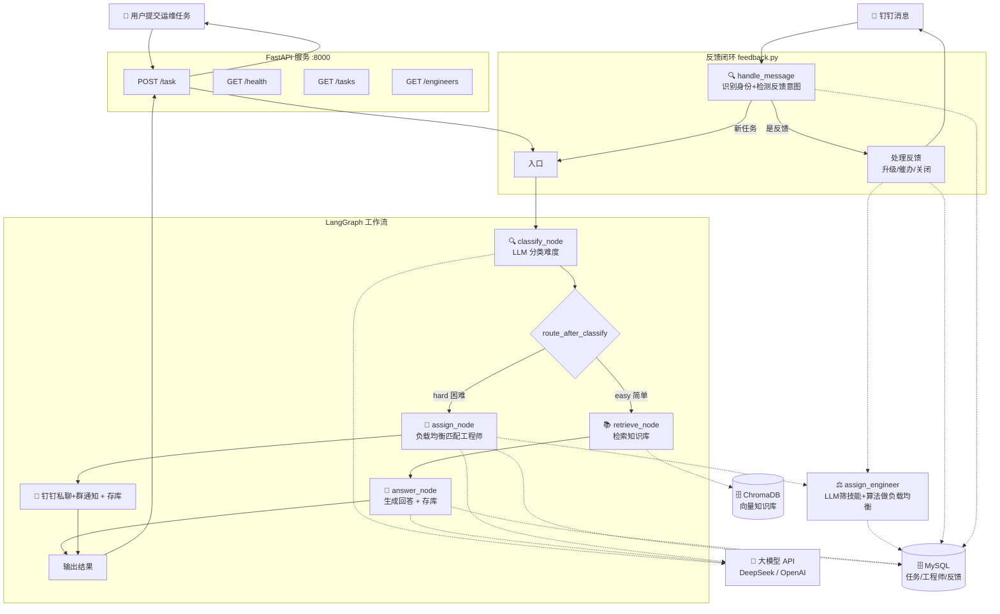

# 🛠️ 运维任务分配 Agent -- 框架文档

## 一、项目概述

一个基于 **LangGraph + FastAPI + ChromaDB + MySQL** 的智能运维任务分配系统。

### 它能做什么

| 场景 | 自动化流程 |
|------|-----------|
| 用户提交「打印机连不上」 | -> 自动分类为「简单」-> 查知识库 -> 自动回复解决步骤 -> 存库待反馈 |
| 用户提交「数据库主库崩溃」 | -> 自动分类为「困难」-> 负载均衡匹配工程师 -> 私聊通知 -> 存库待反馈 |
| 用户回复「还是不行」 | -> 识别为反馈 -> 自动升级分配工程师 -> 通知工程师跟进 |
| 工程师回复「已解决」 | -> 识别为反馈 -> 标记任务已解决 -> 私聊通知提交人 |
| 用户在钉钉给机器人发「hello」 | -> 闲聊过滤 -> 自动识别为「简单」-> 友好回复 |

### 核心技术栈

| 技术 | 在项目中扮演的角色 |
|------|-------------------|
| **LangGraph** | 工作流编排引擎--按「分类->检索/分配->回答」的顺序执行 |
| **ChromaDB** | 向量知识库--把运维文档存成向量，支持语义检索 |
| **MySQL** | 关系型数据库--任务、工程师、反馈记录持久化 |
| **SQLAlchemy** | ORM 框架--统一数据库操作，2.0 Mapped 风格 |
| **FastAPI** | Web 接口--把 Agent 暴露为 HTTP API，供外部调用 |
| **LangChain** | LLM 调用封装--统一调用大模型、管理 Prompt |

---

## 二、系统架构



### 任务状态机

```
┌────────────────┐     用户反馈"未解决"      ┌──────────────┐     工程师回复"已解决"     ┌──────────┐
│ auto_answered  │ ─────────────────────────-> │   assigned   │ ───────────────────────-> │ resolved │
│  (自动已回答)   │                             │  (已分配)     │                           │  (已解决)  │
└────────────────┘                             └──────────────┘                           └──────────┘
        │                                           │
        │ 用户反馈"已解决"                            │ 用户反馈"未解决"→ 重新催办
        └───────────────────────────────────────────┘
```

---

## 三、项目文件结构

```
D:\运维任务分配agent\
├── requirements.txt          ← Python 依赖清单
├── 运维Agent框架文档.md       ← 本文档
├── 第一阶段需求文档.md        ← 第一阶段需求设计文档
├── CHANGELOG.md              ← 更新日志
│
└── data/                     ← 项目代码和数据
    ├── .env                  ← 环境变量（API Key、MySQL 等，不要提交 git）
    ├── engineers.json        ← 工程师名单（首次启动自动迁移到 DB）
    │
    ├── knowledge/            ← 知识库文档（.md 格式）
    │   ├── printer.md        ← 打印机故障处理
    │   ├── vpn.md            ← VPN 连接问题
    │   └── ...               ← 更多知识文档
    │
    ├── chroma_db/            ← 向量数据库（自动生成）
    │
    └── src/                  ← 源代码
        ├── __init__.py       ← 包声明
        ├── models.py         ← 数据结构定义（Pydantic）
        ├── database.py       ← SQLAlchemy 连接 + ORM 模型定义
        ├── db_manager.py     ← 数据库 CRUD 操作封装
        ├── tools.py          ← 工具函数（知识库、工程师加载）
        ├── graph.py          ← LangGraph 工作流（核心调度 + 负载均衡）
        ├── feedback.py       ← 反馈识别与处理（反馈闭环）
        ├── dingtalk_stream.py← 钉钉 Stream 单聊机器人 + 消息路由
        └── main.py           ← FastAPI 入口 + 钉钉 Stream + 启动初始化
```

---

## 四、各文件职责说明

### 4.1 `models.py` -- 数据结构

| 类名 | 用途 | 关键字段 |
|------|------|---------|
| `Difficulty` | 任务难度枚举 | `EASY` / `HARD` |
| `Task` | 一个运维任务 | `title`, `description`, `submitted_by`, `difficulty` |
| `Engineer` | 一个 IT 工程师 | `name`, `skills`, `mobile`, `dingtalk_user_id`, `current_load`, `available` |
| `AgentState` | 工作流内部状态 | `task`, `difficulty`, `knowledge_context`, `final_response`, `assigned_engineer`, `submitter_id`, `task_no` |

**设计要点：** `AgentState` 新增 `submitter_id`（提交人钉钉 ID，反馈追踪用）和 `task_no`（任务编号，存库后回填）。`current_load` 不再手动维护，改为动态查询。

### 4.2 `database.py` -- 数据库连接与 ORM 模型（新增）

| 内容 | 说明 |
|------|------|
| `Engineer` | 工程师表 ORM 模型（name, skills, mobile, dingtalk_user_id, available） |
| `Task` | 任务表 ORM 模型（task_no, title, status, assigned_engineer 等） |
| `Feedback` | 反馈记录表 ORM 模型（task_id, feedback_type, feedback_by） |
| `create_database_if_not_exists()` | 自动创建 MySQL 数据库（无需手动建库） |
| `init_db()` | 建表（已存在的表不重建） |
| `get_db()` | FastAPI 依赖注入用 |

**技术要点：** 使用 SQLAlchemy 2.0 `Mapped` / `mapped_column` 风格。engine 配置 `pool_pre_ping` + `pool_recycle=3600` 防止连接断开。

### 4.3 `db_manager.py` -- 数据库 CRUD 封装（新增）

| 函数 | 作用 |
|------|------|
| `create_task(...)` | 创建任务（自动生成 T1001 编号） |
| `get_user_active_task(submitter_id)` | 查用户最近一条 active 任务（反馈追踪） |
| `get_engineer_active_task(name)` | 查工程师最近一条进行中任务 |
| `update_task_status(task_id, status)` | 更新任务状态（resolved 自动写 resolved_at） |
| `assign_engineer_to_task(task_id, name)` | 绑定工程师 + 状态改 assigned |
| `count_active_tasks(name)` | **动态计算 current_load**（替代原 JSON 静态字段） |
| `load_engineers_from_db()` | 从 DB 加载工程师（替代原读 JSON） |
| `save_engineer_dingtalk_id(name, id)` | 更新工程师钉钉 ID（替代原写 JSON） |
| `create_feedback(task_id, type, by)` | 记录反馈 |

### 4.4 `tools.py` -- 工具函数

| 函数 | 作用 | 变更 |
|------|------|------|
| `retrieve_knowledge(query)` | 语义检索知识库 | 不变 |
| `load_engineers()` | 加载工程师列表 | **改为查 DB，JSON 降级兜底** |
| `count_active_tasks(name)` | 计算工程师活跃任务数 | **新增** |

### 4.5 `graph.py` -- 工作流（核心）

LangGraph 的工作流由 **4 个节点 + 1 个条件分支** 组成：

```
classify_node -> [条件判断] -> retrieve_node -> answer_node（存库 auto_answered）
                           -> assign_node（存库 assigned）
```

| 节点 | 做什么 | 调用 LLM？ | 变更 |
|------|--------|-----------|------|
| `classify_node` | 判断 easy / hard | ✅ | 不变 |
| `route_after_classify` | 路由分支 | ❌ | 不变 |
| `retrieve_node` | 检索知识库 | ❌ | 不变 |
| `answer_node` | 生成回答 | ✅ | **末尾存库 + 附任务编号** |
| `assign_node` | 分配工程师 + 通知 | ✅ | **改用负载均衡 + 存库** |

**新增辅助函数：**
- `assign_engineer(task)` - **混合负载均衡算法**（LLM 筛技能 + 算法选最低负载），供 assign_node 和反馈升级复用
- `_save_task_to_db(state, response, status, engineer)` - 任务存库辅助函数
- `_get_text(response)` - 从 LLM 响应提取文本
- `_notify_engineer(name, task)` - 发送通知（钉钉私聊 + 群简报 / 企微）

### 4.6 `feedback.py` -- 反馈识别与处理（新增）

反馈闭环的核心模块，独立于 LangGraph 主流程。

| 函数 | 作用 |
|------|------|
| `identify_sender(nick, id)` | 识别发送者是工程师还是普通用户 |
| `detect_feedback_intent(text, role)` | 关键词匹配检测反馈意图（resolved/unresolved/None） |
| `handle_message(nick, id, text)` | **反馈处理主入口**，返回反馈结果或 None（走新任务） |
| `_handle_engineer_resolved(task, name)` | 工程师回复"已解决" -> 标记 resolved + 通知用户 |
| `_handle_escalation(task, nick)` | easy 未解决 -> 调用 assign_engineer 升级分配 |
| `_handle_re_escalation(task, nick)` | assigned 未解决 -> 重新催办工程师 |
| `_handle_user_resolved(task, nick)` | 用户反馈"已解决" -> 关闭任务 |

**关键词定义：**
- 用户"已解决"：解决了、可以了、好了、搞定了、已恢复...
- 用户"未解决"：没解决、不行、没用、还是不行、搞不定...
- 工程师"已解决"：已解决、搞定、完成、done、resolved...

### 4.7 `dingtalk_stream.py` -- 钉钉 Stream 机器人

| 内容 | 变更 |
|------|------|
| `process()` | **重构为消息路由：先判断反馈，再走新任务流程** |
| `_auto_fill_engineer_id()` | **改为写 DB**，JSON 降级兜底 |
| `start_stream_bot()` | 不变 |

### 4.8 `main.py` -- API 入口

| 路由 | 方法 | 说明 |
|------|------|------|
| `/task` | POST | 接收任务，运行 Agent，返回结果 |
| `/health` | GET | 健康检查 |
| `/tasks` | GET | **新增**：查询最近任务列表 |
| `/engineers` | GET | **新增**：查询工程师名单（含动态 current_load） |

**启动流程：** `create_database_if_not_exists()` -> `init_db()` -> `migrate_engineers_json_to_db()`（首次启动迁移）

---

## 五、配置文件说明

### 5.1 `.env` 环境变量

| 变量名 | 说明 | 示例值 |
|--------|------|--------|
| `open_code_go_api` | LLM API Key | `sk-xxxxxxxx` |
| `model` | LLM 模型名 | `deepseek-chat` |
| `base_url` | LLM API 地址 | `https://api.deepseek.com` |
| `WECHAT_WEBHOOK` | 企业微信机器人 Webhook（可选） | `https://qyapi.weixin.qq.com/...` |
| `DINGTALK_CLIENT_ID` | 钉钉应用 AppKey（Stream 模式必填） | `dingkc...` |
| `DINGTALK_CLIENT_SECRET` | 钉钉应用 AppSecret（Stream 模式必填） | `abc123...` |
| `MYSQL_HOST` | **新增** MySQL 主机地址 | `localhost` |
| `MYSQL_PORT` | **新增** MySQL 端口 | `3306` |
| `MYSQL_USER` | **新增** MySQL 用户名 | `root` |
| `MYSQL_PASSWORD` | **新增** MySQL 密码 | `你的密码` |
| `MYSQL_DATABASE` | **新增** MySQL 数据库名 | `ops_agent` |

> **注意：** MySQL 数据库和表在首次启动时自动创建，无需手动建库建表。

### 5.2 工程师名单（已迁移到 DB）

工程师数据现存储在 MySQL `engineers` 表中，首次启动时自动从 `engineers.json` 迁移。

| 字段 | 说明 |
|------|------|
| `name` | 姓名（唯一） |
| `skills` | 技能标签列表（JSON） |
| `mobile` | 手机号（钉钉群 @ 提及用） |
| `dingtalk_user_id` | 钉钉 UserID（私聊通知用，首次发消息自动回填） |
| `available` | 是否在岗 |
| `current_load` | **不存字段，动态查询** `count_active_tasks()` |

**匹配逻辑：** LLM 分析任务返回候选人列表 -> 算法从候选人中选负载最低的 -> 优先无任务工程师 -> 同负载随机。

### 5.3 知识库文档

放在 `data/knowledge/` 目录下，每个 `.md` 文件一个主题。支持热更新（增量同步），增删改文件后自动重建向量索引。

---

## 六、启动和测试

### 6.1 安装依赖

```bash
cd D:\运维任务分配agent
pip install -r requirements.txt
```

### 6.2 配置环境变量

编辑 `data/.env`，填入 LLM API Key 和 MySQL 配置：

```env
open_code_go_api=sk-xxxxxxxxxxxxxxxx
model=deepseek-chat
base_url=https://api.deepseek.com

MYSQL_HOST=localhost
MYSQL_PORT=3306
MYSQL_USER=root
MYSQL_PASSWORD=你的密码
MYSQL_DATABASE=ops_agent
```

### 6.3 启动服务

```bash
cd D:\运维任务分配agent\data
python -m src.main
```

启动时会自动：建库 -> 建表 -> 迁移工程师数据 -> 启动 FastAPI + 钉钉 Stream

### 6.4 测试

```bash
# 健康检查
curl http://localhost:8000/health

# 查询任务列表
curl http://localhost:8000/tasks

# 查询工程师名单
curl http://localhost:8000/engineers

# 测试简单任务
curl -X POST http://localhost:8000/task -H "Content-Type: application/json" -d "{\"title\":\"打印机连不上\",\"description\":\"惠普打印机离线\",\"submitted_by\":\"小明\"}"
```

---

## 七、工作流执行示例

### 场景一：简单任务 -> 用户反馈未解决 -> 升级分配

```
用户: "Outlook 无法收发邮件"
  ↓
classify_node -> easy -> retrieve_node -> answer_node
  ↓
answer_node -> 生成回答 + 存库(status=auto_answered) + 附任务编号 T1001
  ↓
用户回复: "还是不行"
  ↓
feedback.handle_message -> 识别为"未解决"反馈
  ↓
_handle_escalation -> 调用 assign_engineer() 负载均衡分配
  ↓
assign_engineer_to_task -> 状态改 assigned + 通知工程师
  ↓
回复用户: "已转给工程师 XX，请稍候"
```

### 场景二：困难任务 -> 工程师已解决

```
用户: "数据库主库崩溃"
  ↓
classify_node -> hard -> assign_node
  ↓
assign_node -> assign_engineer() 负载均衡选人 -> 存库(assigned) -> 通知
  ↓
工程师回复: "已解决"
  ↓
feedback.handle_message -> 识别工程师身份 + "已解决"关键词
  ↓
update_task_status(resolved) + 通知提交人
```

### 场景三：用户确认解决

```
用户: "VPN 连不上" -> auto_answered (T1002)
用户回复: "搞定了"
  ↓
feedback -> 识别"已解决" -> update_task_status(resolved)
  ↓
回复: "已为您关闭任务 T1002，感谢反馈！"
```

---

## 八、下一步扩展方向

| 扩展 | 怎么做 | 难度 | 状态 |
|------|--------|------|------|
| 接入钉钉机器人 | Stream 模式单聊 + 群通知 + 私聊通知 | ⭐ | ✅ 已完成 |
| 任务持久化 | MySQL + SQLAlchemy，状态机追踪 | ⭐⭐ | ✅ 已完成 |
| 反馈闭环 | 关键词识别 + 升级/催办/关闭 | ⭐⭐⭐ | ✅ 已完成 |
| 负载均衡 | LLM 筛技能 + 算法做负载均衡 | ⭐⭐ | ✅ 已完成 |
| 多轮对话 | 用户追问时关联上下文，而非当新任务 | ⭐⭐⭐ | 🔜 待开发 |
| SLA 超时升级 | 任务超时自动催办/升级 | ⭐⭐ | 🔜 待开发 |
| Web 管理后台 | 任务列表/工程师管理/统计看板 | ⭐⭐ | 🔜 待开发 |
| 知识库自动采集 | 从已解决任务提炼 FAQ | ⭐⭐⭐ | 🔜 待开发 |
| 接入工单系统（Jira/禅道） | 在 assign_node 里加 HTTP 请求创建工单 | ⭐⭐ | 🔜 待开发 |

---

## 九、常见问题排查

| 问题 | 可能原因 | 解决方法 |
|------|---------|---------|
| 启动报 `ModuleNotFoundError` | 依赖未安装 | `pip install -r requirements.txt` |
| 数据库连接失败 | MySQL 未启动或密码错误 | 检查 MySQL 服务 + `.env` 中 MYSQL 配置 |
| 数据库表未创建 | 首次启动初始化失败 | 查看启动日志，确认 `init_db()` 执行成功 |
| 工程师名单为空 | DB 迁移未执行 | 确认 `engineers.json` 存在，重启触发迁移 |
| LLM 返回乱码或非 JSON | Prompt 不够严格 | 检查 Prompt 中的「只回复JSON」强调 |
| 知识库检索不到内容 | 文档未向量化 | 删除 `data/chroma_db/` 目录后重启 |
| 钉钉私聊发不出去 | `dingtalk_user_id` 不正确 | 让工程师给机器人发消息，自动绑定 |
| 反馈未识别 | 关键词不在列表中 | 检查 `feedback.py` 中关键词定义，按需补充 |

---

## 十、技术决策备忘

| 决策 | 选择 | 原因 |
|------|------|------|
| Agent 框架 | LangGraph | 比 LangChain Agent 更可控，显式定义工作流图 |
| 向量数据库 | ChromaDB | 轻量、零配置、本地运行，适合小规模知识库 |
| LLM 接入方式 | OpenAI 兼容 API | 换模型只需改 `base_url` 和 `model`，代码不用动 |
| API 框架 | FastAPI | 异步支持好，自带 Swagger 文档，适合微服务 |
| 关系型数据库 | MySQL | 生产级、并发好、团队熟悉 |
| ORM 框架 | SQLAlchemy 2.0 | Mapped 风格类型安全，社区成熟 |
| 工程师负载计算 | 动态查询不存字段 | 避免 current_load 数据不一致 |
| 负载均衡策略 | LLM 筛技能 + 算法选人 | LLM 负责"谁会做"，算法负责"谁来做" |
| 反馈识别 | 关键词匹配 | 简单可靠，不消耗 LLM 调用 |
| 反馈与任务关联 | 追踪最近 active 任务 | 方案 A，简单够用，后续可升级多任务 |

---

## 十一、版本控制

### 版本规范

本项目采用 **语义化版本号**（Semantic Versioning）+ **改版标记**：

| 版本类型 | 格式 | 说明 |
|---------|------|------|
| 大改版 | ` vX.0.0 ` | 架构级变更，新增核心模块 |
| 功能版本 | ` v0.X.0 ` | 新增功能，向后兼容 |
| 修复版本 | ` v0.0.X ` | Bug 修复，小调整 |

---

### 版本历史

#### 🏷️ v1.0.0 -- 第一次大改版（2026-07-09）

> **改版主题：** 从"通知工具"升级为"工单系统" -- 补齐任务持久化、反馈闭环、负载均衡三大核心能力

**新增模块：**

| 模块 | 文件 | 说明 |
|------|------|------|
| 任务持久化 | `database.py` + `db_manager.py` | MySQL + SQLAlchemy ORM，任务状态机追踪 |
| 反馈闭环 | `feedback.py` | 关键词识别 + 升级/催办/关闭，独立于主工作流 |
| 负载均衡 | `graph.py` 中 `assign_engineer()` | LLM 筛技能 + 算法选最低负载 |

**核心改动：**

| 改动项 | 改动前 | 改动后 |
|--------|--------|--------|
| 数据存储 | JSON 文件（engineers.json） | MySQL 数据库（engineers/tasks/feedbacks 三表） |
| 任务追踪 | 无（处理完即丢弃） | 状态机：auto_answered -> assigned -> resolved |
| 工程师分配 | LLM 直接选单人 | LLM 返回候选人 + 算法负载均衡 |
| current_load | JSON 静态字段（永不变化） | 动态查询（COUNT active tasks） |
| 用户反馈 | 不支持 | 关键词识别 + 自动升级/催办/关闭 |
| 工程师反馈 | 不支持 | 回复"已解决"自动关闭任务 + 通知用户 |
| 钉钉消息路由 | 全部走 Agent 工作流 | 先判断反馈，反馈直接处理，新任务才走 Agent |
| ORM 风格 | 无 | SQLAlchemy 2.0 Mapped / mapped_column |

**新增文件：**
- `data/src/database.py` -- 数据库连接 + ORM 模型
- `data/src/db_manager.py` -- CRUD 操作封装
- `data/src/feedback.py` -- 反馈识别与处理
- `第一阶段需求文档.md` -- 需求设计文档

**修改文件：**
- `data/src/models.py` -- AgentState 新增 submitter_id、task_no
- `data/src/tools.py` -- load_engineers 改查 DB + JSON 降级
- `data/src/graph.py` -- 负载均衡算法 + 任务存库 + MATCH_PROMPT 改候选人列表
- `data/src/dingtalk_stream.py` -- 消息路由（先反馈判断）+ ID 绑定改写 DB
- `data/src/main.py` -- 启动初始化 + 数据迁移 + 新增 /tasks /engineers 接口
- `requirements.txt` -- 新增 sqlalchemy、pymysql、cryptography

**新增依赖：**
- `sqlalchemy>=2.0.0`
- `pymysql>=1.1.0`
- `cryptography>=42.0.0`

---

#### 🏷️ v0.2.0 -- 钉钉 Stream 接入（2026-06-15）

- 钉钉 Stream 模式单聊机器人（WebSocket 长连接）
- 工程师钉钉 ID 自动绑定
- 钉钉私聊通知 + 群简报
- 闲聊模式预筛

---

#### 🏷️ v0.1.0 -- 初始版本（2026-06）

- LangGraph 任务分类工作流
- FastAPI REST API
- ChromaDB 向量知识库 + 中文语义检索
- LLM 难度自动分类
- 简单任务自动回复 / 困难任务工程师匹配
- 企业微信/钉钉群通知

---

> 📅 创建日期：2025-01
> 📅 最近大改版：2026-07-09（v1.0.0 第一次大改版）
> 👤 适用对象：IT 运维团队，1-2 人维护
> 🎯 当前状态：任务持久化 + 反馈闭环 + 负载均衡已完成，支持完整工单生命周期
