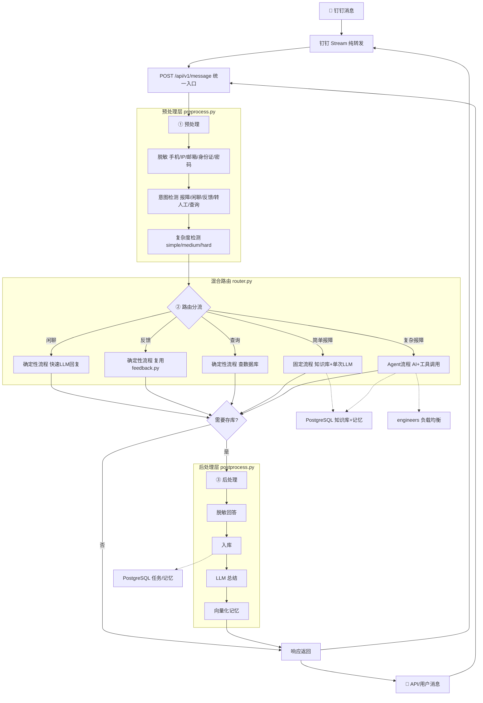

# 🛠️ 运维任务分配 Agent -- 框架文档

## 一、项目概述

一个基于 **FastAPI + LangChain + PostgreSQL + pgvector** 的智能运维任务处理系统。

### 它能做什么

| 场景 | 自动化流程 |
|------|-----------|
| 用户提交「打印机连不上」 | -> 预处理（脱敏+意图+复杂度）-> 固定流程（知识库+单次LLM）-> 自动回复 -> 存库+记忆 |
| 用户提交「数据库主库崩溃」 | -> 预处理 -> Agent流程（模型路由+工具调用）-> 分配工程师 -> 存库+记忆 |
| 用户回复「还是不行」 | -> 预处理识别反馈 -> 复用feedback.py -> 升级分配/催办 |
| 工程师回复「已解决」 | -> 预处理识别反馈 -> 标记resolved -> 通知提交人 |
| 用户在钉钉给机器人发「hello」 | -> 钉钉纯转发 -> API预处理 -> 闲聊快速回复 |

### 核心技术栈

| 技术 | 在项目中扮演的角色 |
|------|-------------------|
| **FastAPI** | Web 接口 -- 统一 API 入口 `POST /api/v1/message` |
| **LangChain** | LLM 调用 + 工具调用（tool calling），单 Agent 架构 |
| **PostgreSQL** | 关系型 + 向量型统一数据库 |
| **pgvector** | PostgreSQL 向量扩展，知识库和记忆的语义检索 |
| **SQLAlchemy 2.0** | ORM，Mapped 风格类型安全 |
| **HuggingFace** | 本地 Embedding 模型（text2vec-base-chinese，768 维） |
| **APScheduler** | 后台定时调度，超时提醒/转派 |
| **钉钉 Stream SDK** | 钉钉 WebSocket 长连接，纯转发层 |

---

## 二、系统架构

### 2.1 混合路由架构



### 2.2 核心设计原则

**能确定的用规则，不确定的才交给 AI。**

| 路由分支 | 处理方式 | LLM 调用 | 存库 | 延迟 |
|---------|---------|---------|------|------|
| 闲聊 | 确定性流程：快速 LLM 回复 | 1次（200 token） | 否 | <1秒 |
| 反馈 | 确定性流程：复用 feedback.py | 0次 | 否 | <0.5秒 |
| 查询状态 | 确定性流程：查数据库 | 0次 | 否 | <0.5秒 |
| 简单报障 | 固定流程：知识库+单次 LLM | 1次 | 是 | 1-2秒 |
| 复杂报障 | Agent 流程：AI+工具调用 | 2-4次 | 是 | 3-8秒 |
| 转人工 | Agent 流程：分配工程师 | 2-4次 | 是 | 3-8秒 |

### 2.3 任务状态机

```
┌────────────────┐     用户反馈"未解决"      ┌──────────────┐     工程师回复"已解决"     ┌──────────┐
│ auto_answered  │ ─────────────────────────-> │   assigned   │ ───────────────────────-> │ resolved │
│  (自动已回答)   │                             │  (已分配)     │                           │  (已解决)  │
└────────────────┘                             └──────────────┘                           └──────────┘
        │                                           │
        │ 用户反馈"已解决"                            │ 用户反馈"未解决"-> 重新催办
        └───────────────────────────────────────────┘
```

---

## 三、项目文件结构

```
运维任务分配agent\
├── requirements.txt          ← Python 依赖
├── 运维Agent框架文档.md       ← 本文档
├── CHANGELOG.md              ← 更新日志
├── 新版架构方案.md            ← v2.0 架构设计文档（历史）
├── 第一阶段需求文档.md        ← v1.0 需求设计文档（历史）
│
└── data/                     ← 数据与代码
    ├── .env                  ← 环境变量（不提交）
    ├── engineers.json        ← 工程师名单（首次启动自动迁移到 DB）
    ├── knowledge/            ← 知识库文档（skill 文档，.md 格式）
    │
    └── src/                  ← 源代码
        ├── __init__.py       ← 包声明
        │
        ├── config.py         ← 模型路由 + 预处理 + 记忆配置
        ├── models.py         ← 数据结构（Intent/Complexity/MessageRequest）
        ├── database.py       ← ORM 模型（PostgreSQL + pgvector，5张表）
        ├── db_manager.py     ← 数据库 CRUD + 向量检索封装
        ├── embedding.py      ← 共享 Embedding 服务（单例模型）
        ├── tools.py          ← 知识库检索（pgvector）+ 工程师加载
        │
        ├── preprocess.py     ← 预处理层（脱敏+意图+复杂度）
        ├── router.py         ← 混合路由（确定性流程+Agent分流）
        ├── ai_agent.py       ← AI 处理层（模型路由+工具调用，仅复杂问题）
        ├── agent_tools.py    ← AI 工具定义（time/knowledge/memory/assign/query）
        ├── postprocess.py    ← 后处理层（脱敏入库+总结+向量化记忆）
        ├── memory.py         ← 交互记忆管理（pgvector 向量检索）
        │
        ├── dingtalk_stream.py← 钉钉 Stream（纯转发层）
        ├── scheduler.py      ← 定时提醒调度器（超时提醒/转派）
        ├── graph.py          ← 核心工具函数（assign_engineer/通知函数）+ 旧版LangGraph
        ├── feedback.py       ← 反馈处理（被 router 复用）
        └── main.py           ← FastAPI 入口（统一 API + 旧版兼容）
```

---

## 四、各文件职责说明

### 4.1 `config.py` -- 模型路由配置

| 配置项 | 说明 |
|--------|------|
| `LLM_API_KEY` / `LLM_BASE_URL` | LLM API 密钥和地址 |
| `MODEL_ROUTING` | 按复杂度路由模型：simple->deepseek-chat，hard->deepseek-reasoner |
| `INTENT_LLM_FALLBACK` | 意图检测规则未命中时是否走 LLM 兜底 |
| `MEMORY_ENABLED` | 是否启用交互记忆 |
| `MEMORY_SEARCH_TOP_K` | 记忆检索返回条数 |
| `MAX_TOOL_ROUNDS` | AI 工具调用最大轮次（防死循环，默认 3） |

### 4.2 `models.py` -- 数据结构

| 类名 | 用途 |
|------|------|
| `Difficulty` | 任务难度枚举（EASY/HARD，旧版兼容） |
| `Intent` | 消息意图枚举（6 种：报障/闲聊/反馈已解决/反馈未解决/转人工/查询） |
| `Complexity` | 复杂度枚举（3 档：SIMPLE/MEDIUM/HARD，驱动模型路由） |
| `MessageRequest` | 统一 API 请求体（source/sender_id/sender_name/content） |
| `MessageResponse` | 统一 API 响应体（intent/complexity/model_used/response/task_no/memory_saved） |
| `PreprocessResult` | 预处理层输出 |
| `AgentState` | 旧版工作流状态（兼容保留） |

### 4.3 `database.py` -- ORM 模型（PostgreSQL + pgvector）

5 张表，统一存储关系型数据 + 向量数据：

| 表名 | 说明 | 向量列 |
|------|------|--------|
| `engineers` | IT 工程师（name/staff_id/skills/mobile/dingtalk_user_id/available） | 无 |
| `tasks` | 运维任务（含 intent/complexity/model_used/raw_content） | 无 |
| `feedbacks` | 任务反馈记录 | 无 |
| `memories` | 交互记忆（summary + embedding） | `embedding Vector(768)` |
| `knowledge_docs` | 知识库分块（source/content + embedding） | `embedding Vector(768)` |

**关键函数：**
- `create_database_if_not_exists()` -- 连接 postgres 库，自动创建目标数据库
- `init_db()` -- 安装 pgvector 扩展 + 建表
- `get_db()` -- FastAPI 依赖注入

### 4.4 `db_manager.py` -- 数据库 CRUD + 向量检索

| 函数分类 | 函数 | 说明 |
|---------|------|------|
| 工程师 | `load_engineers_from_db()` / `get_engineer_by_staff_id()` / `get_engineer_by_mobile()` / `get_engineers_by_name()` / `update_engineer_binding()` | 工程师查询 + 身份绑定回填（按工号） |
| 任务 | `create_task()` / `get_user_active_task()` / `update_task_status()` | 含 intent/complexity/model_used |
| 反馈 | `create_feedback()` / `count_reminders()` | 提醒记录复用 feedbacks 表 |
| 记忆 | `create_memory(embedding)` / `search_memories_by_vector()` | pgvector cosine_distance |
| 知识库 | `add_knowledge_chunk()` / `search_knowledge_by_vector()` | pgvector cosine_distance |
| 知识库 | `get_knowledge_file_hashes()` / `delete_knowledge_by_source()` | 增量同步用 |

### 4.5 `embedding.py` -- 共享 Embedding 服务

| 函数 | 说明 |
|------|------|
| `get_embeddings()` | 获取 HuggingFaceEmbeddings 单例（text2vec-base-chinese，768 维） |
| `compute_embedding(text)` | 计算文本向量，返回 list[float] |

> 所有需要计算向量的模块（tools.py / memory.py）统一通过本模块获取，避免重复加载模型。

### 4.6 `preprocess.py` -- 预处理层

AI 调用前完成，全部用确定性规则 + 轻量 LLM 兜底：

| 步骤 | 函数 | 说明 |
|------|------|------|
| 脱敏 | `desensitize(text)` | 5 类正则：手机号/IP/邮箱/身份证/密码 -> 占位符 |
| 意图检测 | `detect_intent(text)` | 6 种意图，关键词优先 + 轻量 LLM 兜底（max_tokens=20） |
| 复杂度检测 | `detect_complexity(text, intent)` | 3 档：simple/medium/hard，关键词 + 轻量 LLM |
| 主入口 | `preprocess(raw_content)` | 返回 {desensitized, intent, complexity} |

### 4.7 `router.py` -- 混合路由（核心）

| 函数 | 说明 |
|------|------|
| `route(preprocess_result, sender_name, sender_id)` | 主路由：按意图/复杂度分流 |
| `_handle_casual_chat()` | 闲聊 -> 快速 LLM 回复（max_tokens=200） |
| `_handle_feedback()` | 反馈 -> 复用 feedback.py |
| `_handle_query_status()` | 查询 -> 查数据库返回 |
| `_handle_simple_report()` | 简单报障 -> 知识库+单次 LLM（固定流程，一步到位） |
| `_handle_agent()` | 复杂报障 -> 调用 ai_agent.ai_process()（Agent+工具） |

> 反馈无 active 任务时自动转为报障，重新检测复杂度。

### 4.8 `ai_agent.py` -- AI 处理层（仅复杂问题）

| 函数 | 说明 |
|------|------|
| `ai_process(desensitized, intent, complexity, sender_id)` | 主入口：模型路由+意图注入+工具调用 |
| `_get_llm(complexity)` | 按复杂度获取 LLM（simple->chat, hard->reasoner） |
| `_get_tools(complexity)` | 按复杂度获取工具列表 |
| `_build_system_prompt(intent, complexity)` | 构建 system prompt（注入意图上下文） |

> AI 自主决定是否调用工具，最多 MAX_TOOL_ROUNDS（3）轮，防止死循环。

### 4.9 `agent_tools.py` -- AI 工具定义

| 工具 | 说明 |
|------|------|
| `get_current_time` | 获取当前时间 |
| `search_knowledge(query)` | 检索知识库（pgvector 向量检索） |
| `search_memory(query)` | 检索历史交互记忆（pgvector 向量检索） |
| `assign_engineer(candidates, title, desc)` | 分配工程师（AI 通过 Skill 获取信息并传候选人，纯算法选人，0次LLM） |
| `query_user_tasks(sender_id)` | 查询用户任务状态 |

> MCP（Model Context Protocol）作为预留扩展点，未来接入监控/工单/AD 域等外部系统。

### 4.10 `postprocess.py` -- 后处理层

**仅对报障场景执行**（闲聊/反馈/查询跳过）：

| 步骤 | 说明 |
|------|------|
| 二次脱敏 | 对 AI 回答做脱敏（防止 AI 引用了敏感信息） |
| 入库 | 存脱敏版本 + intent/complexity/model_used |
| LLM 总结 | 生成"问题 -> 解决方案"摘要（不超过 50 字） |
| 向量化记忆 | 摘要计算 embedding 存入 memories 表（pgvector） |

### 4.11 `memory.py` -- 交互记忆管理

| 函数 | 说明 |
|------|------|
| `save_memory(summary, task_id, metadata)` | 计算向量 + 存入 memories 表 |
| `search_memory(query, top_k)` | pgvector cosine_distance 检索历史记忆 |
| `get_memory_count()` | 记忆总数 |

### 4.12 `tools.py` -- 知识库检索 + 工程师加载

| 函数 | 说明 |
|------|------|
| `sync_knowledge(force)` | 增量同步知识库（比较文件 MD5 哈希，变更的分块+向量化+存入 knowledge_docs） |
| `retrieve_knowledge(query, top_k)` | pgvector 向量检索知识库（自动触发增量同步，5秒冷却） |
| `load_engineers()` | 从 DB 加载工程师（降级读 JSON） |
| `count_active_tasks(name)` | 动态计算工程师负载 |

### 4.13 `dingtalk_stream.py` -- 钉钉 Stream（纯转发层）

| 内容 | 说明 |
|------|------|
| `OpsAgentChatbot.process()` | 收到消息 -> 转发 `POST /api/v1/message` -> 回复用户 |
| `_auto_bind_engineer()` | 委托 `engineer_matcher` 按工号绑定工程师身份（工号直连/首次登记） |
| `start_stream_bot()` | 启动 WebSocket 长连接 |

> 零业务代码，所有逻辑集中在 API 层。工程师身份匹配委托给独立的 `engineer_matcher.py`（见 4.14）。

### 4.14 `engineer_matcher.py` -- 工程师身份匹配层（按工号绑定）

| 函数 | 说明 |
|------|------|
| `match_and_bind(sender_nick, sender_staff_id, sender_user_id)` | 按工号绑定工程师身份，返回 `MatchResult` |
| `_locate_unbound_engineer()` | 首次绑定：在未登记工号的工程师中用姓名/手机号唯一定位 |
| `_bind_user_id()` / `_bind_staff_and_user()` | 工号直连绑定 / 首次登记工号+绑定 |

> 独立模块，不依赖钉钉 SDK（只接收字符串参数）；`dingtalk_user_id` 仅在工号确立后写入。
> 工号取自钉钉消息回调的 `sender_staff_id`，无需对接通讯录 API；名单无需预填工号，首次发消息自动回填。

### 4.15 `scheduler.py` -- 定时提醒调度器

| 函数 | 说明 |
|------|------|
| `check_overdue_tasks()` | 每分钟扫描 assigned 状态任务 |
| `_send_reminder()` | 钉钉私聊提醒工程师 |
| `_try_reassign()` | 达上限后转派（排除当前工程师） |
| `start_scheduler()` | 启动 APScheduler |

> 提醒记录复用 feedbacks 表（feedback_by = "系统提醒|工程师名"），不改表结构。

### 4.15 `graph.py` -- 核心工具函数 + 旧版 LangGraph

**仍在使用的函数（被 4 个模块引用）：**

| 函数 | 被谁调用 |
|------|---------|
| `assign_engineer(task, exclude_name)` | agent_tools.py / feedback.py / scheduler.py |
| `_notify_engineer(name, task)` | feedback.py / scheduler.py |
| `_send_dingtalk_direct_message(user_id, title, text)` | feedback.py / scheduler.py |

**旧版 LangGraph（仅 /task 接口使用）：**

| 函数 | 说明 |
|------|------|
| `classify_node` / `route_after_classify` | 旧版分类节点 |
| `retrieve_node` / `answer_node` / `assign_node` | 旧版处理节点 |
| `build_graph()` | 编译 LangGraph 工作流 |

### 4.16 `feedback.py` -- 反馈处理（被 router 复用）

| 函数 | 说明 |
|------|------|
| `handle_message(sender_nick, sender_id, text)` | 主入口：识别身份 + 检测反馈 |
| `identify_sender(nick, id)` | 区分工程师 vs 普通用户 |
| `_handle_engineer_resolved()` | 工程师回复"已解决" -> 标记 resolved + 通知用户 |
| `_handle_escalation()` | easy 未解决 -> 调用 assign_engineer 升级分配 |
| `_handle_re_escalation()` | assigned 未解决 -> 重新催办 |

### 4.17 `main.py` -- FastAPI 入口

| 路由 | 方法 | 说明 |
|------|------|------|
| `/api/v1/message` | POST | ★ 统一入口：预处理 -> 路由 -> 后处理 |
| `/task` | POST | 旧版兼容：LangGraph 工作流 |
| `/health` | GET | 建康检查 |
| `/tasks` | GET | 查询任务列表 |
| `/engineers` | GET | 查询工程师名单 |
| `/memories` | GET | 查询交互记忆 |

**启动流程：** `create_database_if_not_exists()` -> `init_db()` -> `migrate_engineers_json_to_db()` -> `start_scheduler()` -> FastAPI + 钉钉 Stream

---

## 五、配置文件说明

### 5.1 `.env` 环境变量

| 变量名 | 说明 | 示例值 |
|--------|------|--------|
| `open_code_go_api` | LLM API Key | `sk-xxxxxxxx` |
| `model` | LLM 模型名 | `deepseek-chat` |
| `base_url` | LLM API 地址 | `https://api.deepseek.com` |
| `PG_HOST` | PostgreSQL 主机 | `localhost` |
| `PG_PORT` | PostgreSQL 端口 | `5432` |
| `PG_USER` | PostgreSQL 用户名 | `postgres` |
| `PG_PASSWORD` | PostgreSQL 密码 | `你的密码` |
| `PG_DATABASE` | PostgreSQL 数据库名 | `ops_agent` |
| `MODEL_SIMPLE` | 简单问题模型 | `deepseek-chat` |
| `MODEL_MEDIUM` | 中等问题模型 | `deepseek-chat` |
| `MODEL_HARD` | 复杂问题模型 | `deepseek-reasoner` |
| `INTENT_LLM_FALLBACK` | 意图检测 LLM 兜底 | `true` |
| `MEMORY_ENABLED` | 启用记忆 | `true` |
| `MEMORY_SEARCH_TOP_K` | 记忆检索条数 | `3` |
| `DINGTALK_CLIENT_ID` | 钉钉 AppKey | `dingkc...` |
| `DINGTALK_CLIENT_SECRET` | 钉钉 AppSecret | `abc123...` |
| `REMINDER_INTERVAL_MINUTES` | 提醒间隔 | `30` |
| `REMINDER_MAX_COUNT` | 最大提醒次数 | `3` |

### 5.2 工程师名单

首次启动从 `engineers.json` 自动迁移到 PostgreSQL `engineers` 表。`current_load` 不存字段，动态查询。

### 5.3 知识库文档

放在 `data/knowledge/` 下，`.md` 格式。支持增量热更新：增删改文件后自动同步到 `knowledge_docs` 表（pgvector 向量化）。

---

## 六、启动和测试

### 6.1 安装依赖

```bash
cd 运维任务分配agent
pip install -r requirements.txt
```

### 6.2 配置环境变量

编辑 `data/.env`：

```env
open_code_go_api=sk-xxxxxxxx
model=deepseek-chat
base_url=https://api.deepseek.com

PG_HOST=localhost
PG_PORT=5432
PG_USER=postgres
PG_PASSWORD=你的密码
PG_DATABASE=ops_agent
```

### 6.3 启动服务

```bash
cd data
python -m src.main
```

启动时自动：建库 -> 安装 pgvector 扩展 -> 建表 -> 迁移工程师数据 -> 启动定时提醒 -> FastAPI + 钉钉 Stream

### 6.4 测试

```bash
# 统一入口
curl -X POST http://localhost:8000/api/v1/message \
  -H "Content-Type: application/json" \
  -d '{"source":"api","sender_name":"小明","content":"打印机连不上"}'

# 管理接口
curl http://localhost:8000/health
curl http://localhost:8000/tasks
curl http://localhost:8000/engineers
curl http://localhost:8000/memories
```

---

## 七、完整请求流程

```
用户: "打印机连不上，IP是192.168.1.100"
  │
  ▼
① 钉钉 Stream 转发 -> POST /api/v1/message
  │
  ▼
② 预处理层
  ├─ 脱敏: "打印机连不上，IP是[IP]"
  ├─ 意图检测: report_issue
  └─ 复杂度检测: simple
  │
  ▼
③ 混合路由 -> simple + report_issue -> 固定流程
  ├─ 检索知识库（pgvector）: printer.md
  ├─ 检索记忆（pgvector）: 无相关
  └─ 单次 LLM 生成回答
  │
  ▼
④ 后处理层
  ├─ 脱敏回答
  ├─ 入库: task T1042, status=auto_answered
  ├─ LLM 总结: "打印机离线 -> 检查电源/重启服务"
  └─ 向量化: embedding 存入 memories 表
  │
  ▼
⑤ 响应返回 -> 钉钉回复用户
```

---

## 八、扩展方向

| 扩展 | 怎么做 | 难度 |
|------|--------|------|
| 增加知识 | 往 `data/knowledge/` 添加 `.md` 文件 | ⭐ |
| 增加 AI 工具 | 在 `agent_tools.py` 加 `@tool` 函数 | ⭐⭐ |
| 接入 MCP | 实现 MCP 客户端，标准化外部系统接入 | ⭐⭐⭐ |
| 新意图 | 在 `preprocess.py` 加关键词 + 路由分支 | ⭐⭐ |
| 新消息渠道 | 仿 `dingtalk_stream.py` 写转发层 | ⭐⭐ |
| 新定时任务 | 仿 `scheduler.py` 加 APScheduler job | ⭐⭐ |

---

## 九、常见问题排查

| 问题 | 可能原因 | 解决方法 |
|------|---------|---------|
| 启动报 ModuleNotFoundError | 依赖未安装 | `pip install -r requirements.txt` |
| 数据库连接失败 | PostgreSQL 未启动或密码错误 | 检查 PostgreSQL 服务 + `.env` 中 PG_* 配置 |
| 数据库表未创建 | pgvector 扩展未安装 | 查看启动日志，确认 `init_db()` 成功 |
| 脱敏未生效 | 正则未覆盖 | 检查 `preprocess.py` 中 DESENSITIZE_PATTERNS |
| 意图检测误判 | 关键词未覆盖 | 检查 `preprocess.py` 关键词列表，或开启 LLM 兜底 |
| 简单问题走了 Agent | 复杂度检测不准 | 检查 `preprocess.py` 复杂度规则 |
| 知识库检索不到 | 知识库未同步 | 重启触发同步，或检查 `knowledge_docs` 表 |
| 钉钉转发超时 | LLM 响应慢 | 调整 `dingtalk_stream.py` 中 timeout |
| 定时提醒未触发 | 调度器未启动 | 查看启动日志是否有 `[scheduler] ✅ 定时提醒已启动` |

---

## 十、技术决策备忘

| 决策 | 选择 | 原因 |
|------|------|------|
| 入口 | 统一 API | 钉钉纯转发，所有逻辑集中 API 层 |
| 架构 | 混合路由 | 确定性流程+Agent，能确定的用规则，不确定的才交给AI |
| AI 框架 | LangChain tool calling | 单 agent + 工具，不做多节点编排 |
| 模型路由 | 按复杂度选模型 | 简单用便宜模型，复杂用推理模型，成本可控 |
| 数据库 | PostgreSQL + pgvector | 关系型+向量统一存储，一套数据库 |
| 预处理 | 规则 + 轻量 LLM | 不消耗主 LLM token，成本低 |
| 反馈识别 | 关键词匹配 | 简单可靠，不消耗 LLM 调用 |
| 记忆 | pgvector 向量检索 | 每次交互向量化存储，相似问题命中历史经验 |
| 负载均衡 | LLM 筛技能 + 算法选人 | LLM 负责"谁会做"，算法负责"谁来做" |
| 工程师负载 | 动态查询不存字段 | 避免 current_load 数据不一致 |
| 定时提醒 | APScheduler 进程内 | 轻量，与 FastAPI 同进程 |

---

## 十一、版本控制

### 版本规范

| 版本类型 | 格式 | 说明 |
|---------|------|------|
| 大改版 | `vX.0.0` | 架构级变更 |
| 功能版本 | `v0.X.0` | 新增功能 |
| 修复版本 | `v0.0.X` | Bug 修复 |

### 版本历史

#### 🏷️ v2.3.0 -- 负载均衡改为 Skill + Tool 模式（2026-07-10）

> 去掉工具内 LLM 调用，AI 通过 Skill 获取工程师信息，工具只做纯算法选人

- 新增 `engineers-info.md`：工程师团队信息 Skill 文档
- `graph.py` 新增 `assign_engineer_by_algorithm()`：纯算法选人
- `agent_tools.py` 改造 `assign_engineer` 工具：参数改为 `candidates`
- LLM 调用从 2-3 次降为 1 次

#### 🏷️ v2.2.0 -- 数据库统一为 PostgreSQL + pgvector（2026-07-10）

> 废弃 ChromaDB，两套数据库合并为一套 PostgreSQL

- 新增 `embedding.py`：共享 Embedding 服务
- 新增 `KnowledgeDoc` 表：知识库分块 + 向量
- `Memory` 表新增 embedding 列
- 知识库/记忆检索改用 pgvector cosine_distance
- 依赖变更：pymysql->psycopg2-binary，移除 chromadb

#### 🏷️ v2.1.0 -- 混合路由架构（2026-07-10）

> 确定性流程 + Agent，简单问题一步到位

- 新增 `router.py`：预处理后按意图/复杂度分流
- 闲聊/反馈/查询 -> 确定性流程（0-1次LLM）
- 简单报障 -> 固定流程（知识库+单次LLM）
- 复杂报障 -> Agent+工具调用

#### 🏷️ v2.0.0 -- 新版架构重构（2026-07-10）

> 统一入口 + 预处理 + 模型路由 + 工具化AI + 记忆

- 新增 `config.py` / `preprocess.py` / `ai_agent.py` / `agent_tools.py` / `postprocess.py` / `memory.py`
- 统一入口 `POST /api/v1/message`
- 钉钉 Stream 退化为纯转发层
- 预处理层：脱敏 + 意图检测 + 复杂度检测
- 模型路由：按复杂度选模型
- 单 Agent + 5 工具
- 后处理：脱敏入库 + LLM 总结 + 向量化记忆

#### 🏷️ v1.1.0 -- 定时重新提醒（2026-07-10）

- 新增 `scheduler.py`：APScheduler 后台调度
- 30分钟未解决 -> 提醒，3次未响应 -> 自动转派

#### 🏷️ v1.0.0 -- 第一次大改版（2026-07-09）

> 任务持久化 + 反馈闭环 + 负载均衡

- MySQL + SQLAlchemy ORM
- 任务状态机：auto_answered -> assigned -> resolved
- 反馈闭环：关键词识别 + 升级/催办/关闭
- 负载均衡：LLM 筛技能 + 算法选最低负载

#### 🏷️ v0.2.0 -- 钉钉 Stream 接入（2026-06-15）

- 钉钉 Stream 单聊机器人
- 工程师 ID 自动绑定
- 钉钉私聊通知 + 群简报

#### 🏷️ v0.1.0 -- 初始版本（2026-06）

- LangGraph 任务分类工作流
- FastAPI REST API
- ChromaDB 向量知识库

---

> 📅 创建日期：2025-01
> 📅 最近更新：2026-07-10（v2.3.0 Skill+Tool 重构）
> 👤 适用对象：IT 运维团队，1-2 人维护
> 🎯 当前状态：混合路由 + 统一数据库 + Skill+Tool 扩展 + 持久化记忆
